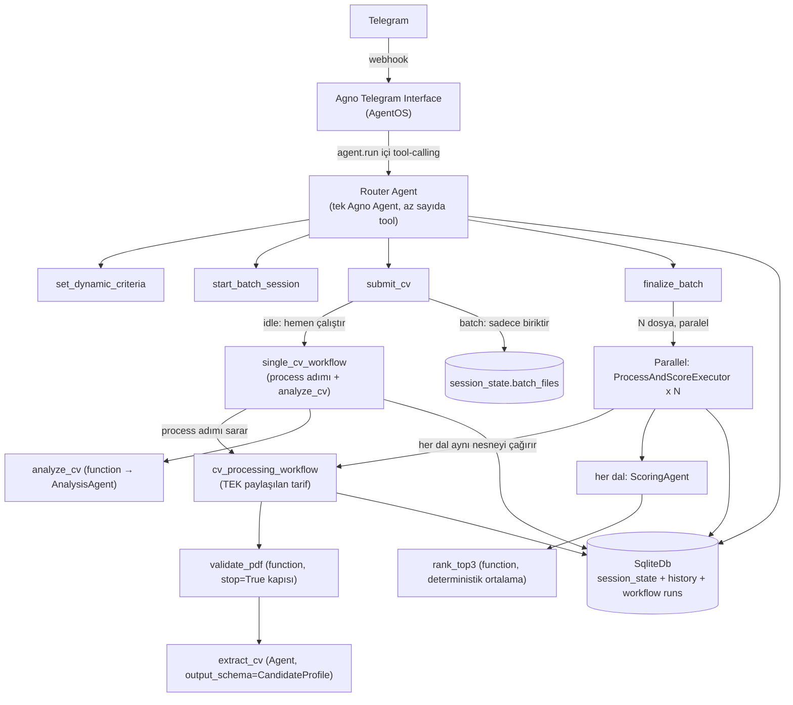
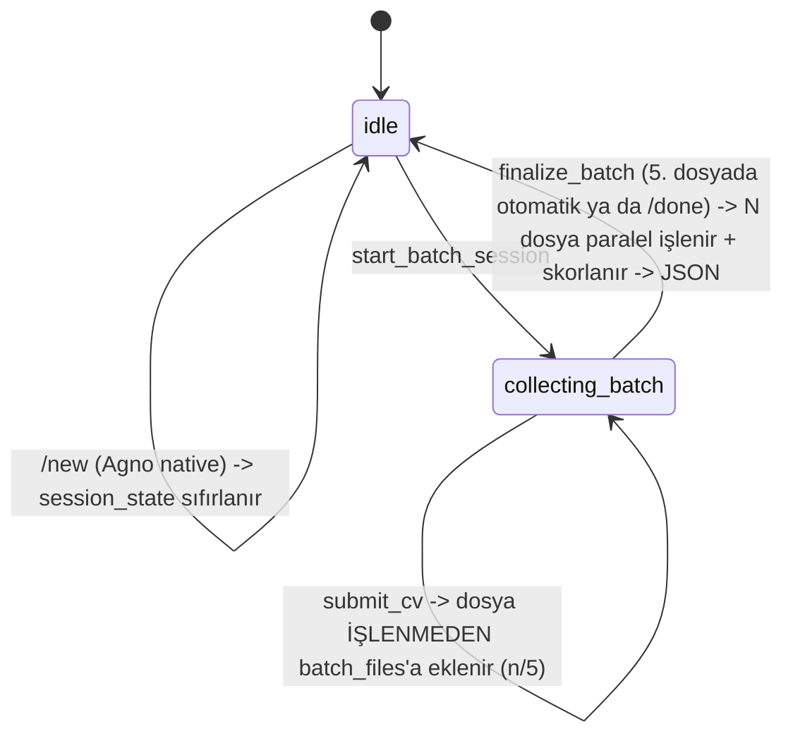
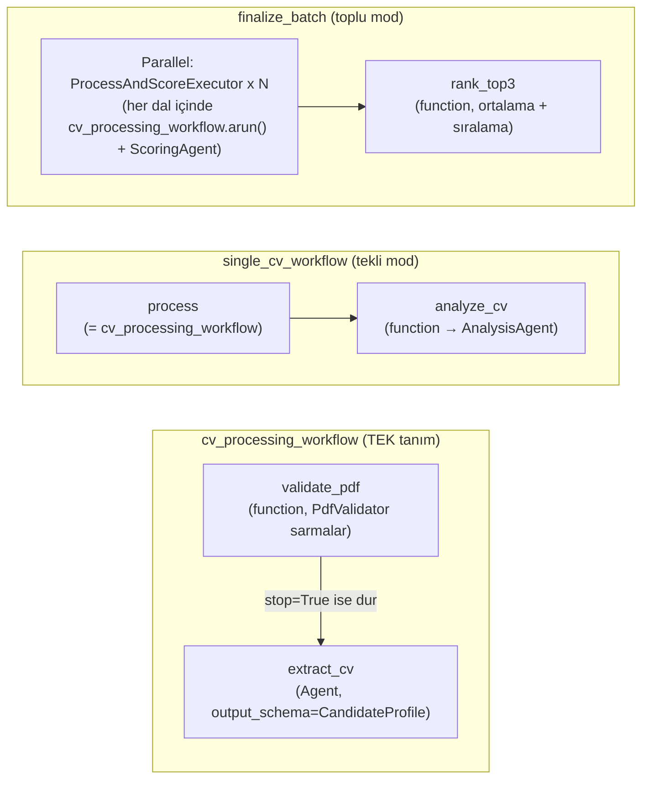

# Mimari Kararlar — telegram-ai-hr-bot

Bu doküman "Yapay Zeka Destekli Dinamik Telegram İK ve Sohbet Botu" ödevi için
alınan mimari kararları kaydeder. Bu doküman her kararın gerekçesini de kaydeder.
Bu doküman kod yazılmadan önce hazırlandı. Bu dokümanın iki amacı var: geliştirme
sırasında referans olmak, ve mülakat savunmasında "neden böyle tasarladın"
sorularına net cevap vermek.

> Çalışma ilkeleri (KISS, aşamalı geliştirme, en iyi uygulama zorunluluğu)
> `AGENTS.md` §0'dadır. Bu ilkeler tüm proje için geçerlidir. Bu ilkeleri burada
> tekrar etmiyoruz.

## 1. Genel Bakış

Bot iki modda çalışır:

1. **Genel sohbet** — bağlamı (chat history) korur, serbest sohbet eder.
2. **İK modu** — kullanıcının serbest metinle tanımladığı dinamik kriterlere göre
   CV analiz eder. Tekli CV için nitel rapor üretir. Çoklu CV için (en fazla 5)
   karşılaştırmalı skorlama yapar.

## 2. Teknoloji Seçimleri

| Katman | Seçim | Gerekçe |
|---|---|---|
| Dil | Python 3.11+ | Agno framework'ü Python-native'dir. Python, ödevin izin verdiği 3 dilden biridir. |
| Agent framework | **Agno** | `output_schema` ile yapılandırılmış çıktı verir. Model sağlayıcıyı soyutlar. Hazır bir Telegram interface'i var. Native bir `Workflow` bileşeni var. (LangChain ile karşılaştırma sohbet geçmişinde yapıldı.) |
| Telegram bağlantısı | **Agno `AgentOS` + `Telegram` interface** | Kullanıcı tercihi: hazır webhook/session altyapısını kullan. Dosya erişimi riski doğrulandı ve çözüldü (bkz. §10.1). |
| CV işleme pipeline'ı | **Tek, paylaşılan Agno `Workflow`** (`cv_processing_workflow`) | Bkz. §6. Agno'nun ardışık çok-adımlı ajan zincirleri için resmi deseni budur. Tekli ve toplu mod aynı nesneyi çalıştırır — bu tutarlılık KISS'in bir parçasıdır (bkz. `AGENTS.md` §0). |
| LLM sağlayıcı | **OpenAI (başlangıç) → Ollama (sonra)** | Geliştirme hızı için önce OpenAI kullanılır. `MODEL_PROVIDER` env değişkeniyle, tek satır değişiklikle Ollama'ya geçilir. |
| Veritabanı | **SQLite** (`agno.db.sqlite.SqliteDb`) | Sıfır altyapı gerektirir, yerel geliştirme için yeterlidir. Router Agent'ın session/memory'si ve Workflow'ların kendi geçmişi aynı dosyayı paylaşır. |
| PDF işleme | `pypdf` | Bozuk/şifreli PDF'i tespit eder (`PdfReadError`). Metin çıkarır. Framework'ten bağımsızdır. |
| Paralellik | **Agno `Parallel` step** (native, limitsiz) | Bkz. §8. Batch en fazla 5 CV'dir. Bu yüzden elle `asyncio.Semaphore` yazmak yerine framework'ün kendi mekanizması kullanılır. |
| Konteynerleştirme | v1'de **yok** | Kullanıcı kararı: önce fonksiyonel kapsam biter, Docker sonraki iterasyonda eklenir (bkz. §13). |

## 3. Sistem Mimarisi



**Katman sorumlulukları:**

- **Telegram Interface (Agno):** webhook alır, mesaj ve medya indirir, session_id
  ve user_id eşler, yanıtı akış (streaming) olarak gönderir. Bu katman hazırdır —
  biz yazmayız.
- **Router Agent:** Telegram'a bağlı tek Agno `Agent`'tır. Az sayıda, net isimli
  tool'a sahiptir. Bu ajanın tek "akıllı" kararı, hangi tool'un çağrılacağıdır.
  Kararlılık gereksinimini LLM'in tutarlılığına değil, koda dayandırıyoruz.
- **`cv_processing_workflow`:** bir adayı doğrulama ve çıkarma işleminin tek,
  paylaşılan tarifidir. Tekli mod ve toplu mod bunu aynı nesne olarak çağırır —
  ayrıntı §6'dadır.
- **Servisler:** `PdfValidator` — LLM içermez, test edilebilir, saf Python'dır.
  `cv_processing_workflow`'un ilk adımı bu servisi sarmalar ve çağırır (bkz. §9).

## 4. Konuşma Akışı (State Machine)

Durum `session_state` içinde tutulur. Bu durum Agno `RunContext.session_state`
içindedir. Telegram her chat/kullanıcı için bu durumu otomatik izole eder:

```python
session_state = {
    "mode": "idle",          # idle | collecting_batch
    "dynamic_criteria": None,  # list[str] | None
    "batch_files": [],          # HAM, işlenmemiş dosyalar (extraction finalize_batch'e ertelenir)
}
```



**Tetikleyiciler (kullanıcı tarafı):**
- **Kriter tanımlama:** kullanıcı serbest metin yazar (örnek: *"Bu CV'yi React
  tecrübesi ve temiz koda göre skorla"*). Agent bu metni okur ve
  `set_dynamic_criteria(criteria: list[str])` tool'unu çağırır.
- **Tekli analiz:** kriter tanımlıyken kullanıcı tek bir PDF gönderir. `submit_cv`
  çağrılır. Batch modda değilse, `submit_cv` `single_cv_workflow`'u hemen çalıştırır.
- **Toplu analiz:** kullanıcı `/batch_analyze` yazar (ya da "birden fazla CV
  göndereceğim" gibi doğal dil kullanır). `start_batch_session` çağrılır. Sonra
  kullanıcı PDF'leri tek tek gönderir, ama bu PDF'ler işlenmez — sadece biriktirilir.
  `/done` yazınca ya da 5. dosya gelince, `finalize_batch` tetiklenir. Bu andan
  sonra hepsi aynı anda işlenir ve skorlanır.
- **Sıfırlama:** Agno'nun native `/new` komutu session_state'i temizler. Bu proje
  ayrı bir `reset` tool'u yazmaz.

## 5. Tool Tasarım İlkesi: "LLM router, kod garantör"

Değerlendirme kriteri #1 şunu ister: *"hem tekli hem de çoklu modları kararlı
çalıştırabilme"*. Bu yüzden mod geçişlerini LLM'in her seferinde doğru karar
vermesine bağlamak istemiyoruz:

- LLM'in tek sorumluluğu, hangi tool'un çağrılacağını seçmektir.
- Her tool, çağrıldığı anda `session_state["mode"]`'u kendi içinde kontrol eder.
  Geçersiz bir çağrıyı reddeder (örnek: batch modda değilken `finalize_batch`
  çağrılması) ve kullanıcıya açık bir mesaj gösterir. LLM yanlış tool çağırsa bile,
  sistem tutarsız bir duruma düşmez.
- `submit_cv` tool'unun imzasında dosya içeriği LLM'e argüman olarak yazdırılmaz.
  Agno'nun `files: Optional[Sequence[File]]` built-in tool parametresi, o turun
  ekli medyasını otomatik enjekte eder (bkz. §10.1, doğrulandı).
- Router Agent'a bir `pre_hook` eklenir. O turda ekli dosya varsa, `pre_hook`
  `tool_choice`'u `submit_cv`'ye sabitler. Böylece "kullanıcı PDF gönderdiğinde
  `submit_cv`'yi çağır" artık LLM'in inisiyatifine bırakılan bir talimat değildir
  — kod seviyesinde garanti edilir.
- Tool'ların içindeki iş mantığı `cv_processing_workflow`'u çalıştırır (§6). Bu,
  kararlılığı bir kat daha güçlendirir: adım sırası kod tarafından sabittir. LLM
  sadece kendi adımındaki tek görevi yapar (extract, analyze, ya da score).

## 6. CV İşleme Pipeline'ı — Tek, Paylaşılan `Workflow`

**Kilit karar:** Bir adayı işlemenin (doğrula → çıkar) tek bir tanımı var:
`cv_processing_workflow`. Tekli mod bunu bir kez çalıştırır. Toplu mod aynı nesneyi
N aday için paralel çalıştırır. İki farklı mimari kurmak yerine — biri düz kod,
biri Workflow — tek, tutarlı bir tarif kullanıyoruz. İki sebep bu kararı destekler:
KISS (bkz. `AGENTS.md` §0), ve Agno'nun kendi deseni (ardışık çok-adımlı ajan
zincirleri resmi örneklerde hep `Workflow` ile kurulur, paralellik şart değildir).



| Parça | Adımlar | Ne zaman / nasıl çalışır | Çıktı |
|---|---|---|---|
| **`cv_processing_workflow`** | `validate_pdf` (function) → `extract_cv` (Agent) | Tekli mod ve toplu mod bunu aynı nesne olarak çağırır | `CandidateProfile`, ya da bir doğrulama hatası (`stop=True` ile erken biter) |
| **`single_cv_workflow`** | `Step(workflow=cv_processing_workflow)` → `analyze_cv` (function) | `submit_cv` içinde, idle modda ve kriter tanımlıysa, hemen | `SingleAnalysisResult.markdown_report` |
| **toplu (`finalize_batch`)** | `Parallel(ProcessAndScoreExecutor x N)` → `rank_top3` (function) | `finalize_batch` çağrıldığında. Her dal kendi içinde `cv_processing_workflow.arun(files=[kendi_dosyası])` çağırır, sonra `ScoringAgent`'ı çağırır | `BatchAnalysisResult` (ödev JSON şeması) |

**Kritik tasarım kuralları:**

1. **Kriter nasıl taşınır:** Dinamik kriterler `session_state`'te yaşar. Bu
   kriterler workflow adımlarının doğal `previous_step_content` zincirinin
   parçası değildir. Bu yüzden `workflow.run(input=json.dumps({"criteria":...}),
   files=[...])` çağrılırken kriter `input` olarak geçilir. Herhangi bir adım bu
   kriteri `step_input.get_input_as_string()` ile okuyabilir. `previous_step_content`
   ise pipeline'ın işlediği asıl veriyi taşır — önce çıkarılan metni, sonra
   `CandidateProfile`'ı. Bu iki taşıyıcıyı ayrı tutmak bilinçli bir karardır.
2. **Doğrulama kapısı:** `validate_pdf` adımı `PdfValidator`'ı (§9) çağıran bir
   function-executor'dır. Sonuç geçersizse, `StepOutput(content=hata_mesajı,
   stop=True)` döner. Bu, Agno'nun resmi "validation gate" desenidir. Workflow o
   an durur. `extract_cv`, `analyze_cv`, ve `score_cv` çalışmaz. Hiçbir ek LLM
   çağrısı yapılmaz.
3. **Structured output zincirleme:** `extract_cv` adımı `output_schema=CandidateProfile`
   ile çalışan bir Agent step'tir. Çıktısı bir sonraki adıma tipli bir Pydantic
   nesnesi olarak geçer. Agno bu çıktıyı string'e çevirmez — bu davranış resmi
   `structured-io-at-each-step-level` örneğiyle doğrulandı. `analyze_cv` ve
   `score_cv` fonksiyonları `step_input.previous_step_content`'i doğrudan
   `CandidateProfile` olarak kullanabilir.
4. **`analyze_cv` ve `score_cv` neden Agent step değil, function-executor:** Bu
   iki adım iki farklı kaynağa aynı anda ihtiyaç duyar: `CandidateProfile`'ı
   (önceki adımdan) ve dinamik kriterleri (workflow input'undan). Bu iki adım bu
   iki kaynağı birleştirir, sonra ilgili uzman ajana (`AnalysisAgent` ya da
   `ScoringAgent`) özel bir prompt olarak verir. Bu, Agno'nun kendi "custom
   function step" deseniyle eşleşir.
5. **`score_cv` ve Parallel:** `finalize_batch`, toplanan her `(CandidateProfile,
   pdfFileName)` çifti için ayrı bir class-based executor örneği oluşturur
   (`ScoreCvExecutor(profile, filename)` — `__call__(self, step_input)` metoduyla).
   `finalize_batch` bu örnekleri `Parallel(*executors)` içine koyar. Agno'nun
   `Parallel`'ı bloktaki tüm dalları aynı anda çalıştırır (§8).
6. **`rank_top3`:** `Parallel` bloğunun tüm dal çıktıları toplu halde alınır.
   `averageScore` Python'da hesaplanır — bu hesap LLM'e bırakılmaz. İlk 3 aday
   sıralanır, sonra ödevin JSON şemasına dönüştürülür.

## 7. Veri Modelleri

**`PdfValidationResult`** (§9'daki 6 kontrolün tipli çıktısı, LLM içermez):
```
status: EMPTY_FILE | NOT_A_PDF | ENCRYPTED | CORRUPTED | EMPTY_PDF | NO_EXTRACTABLE_TEXT | VALID
extracted_text: str | None     # sadece status == VALID iken dolu
user_message: str | None       # sadece status != VALID iken dolu, Telegram'a birebir gönderilir
```

**`CandidateProfile`** (LLM Extraction'ın ürettiği ortak şema — ödevin istediği
"farklı PDF formatlarını normalize eden JSON"):
```
full_name: str | None
skills: list[str]
work_experience: list[str]      # özetlenmiş deneyim girdileri
languages: list[str]
education: list[str]
```

**`SingleAnalysisResult`** (tekli CV nitel raporu):
```
candidate_name: str
strengths: list[str]
weaknesses: list[str]
recommendations: list[str]
markdown_report: str            # Telegram'a doğrudan gönderilecek Markdown
```

**`CandidateScore`** ve **`BatchAnalysisResult`:** ödev dokümanındaki JSON
şemasıyla birebir aynı alan adları kullanılır (`status`, `processedCVCount`,
`userDefinedCriteria`, `topCandidates[].rank/candidateName/pdfFileName/
dynamicScores/averageScore/hrEvaluation`). Bu alan adları camelCase'dir — ödev
örneğine sadık kalınır. `dynamicScores` değerleri Pydantic `Field(ge=0, le=100)`
ile 0-100 aralığına kısıtlanır. `candidateName` boş dönerse (extraction isim
bulamazsa), `pdfFileName` bu alanın yerine geçer.

## 8. Paralellik: Agno `Parallel` (native, limitsiz)

Kullanıcı kararı: elle `asyncio.Semaphore` yazmak yerine Agno'nun `Parallel`
step'i kullanılır. Eşzamanlılık sınırlanmaz.

- `finalize_batch`'teki `Parallel(ProcessAndScoreExecutor x N)` en fazla 5
  eşzamanlı `cv_processing_workflow` çalıştırması yapar, çünkü N ≤ 5'tir. Bu sayı
  standart OpenAI rate limitlerinin çok altındadır.
- Tek bir CV'nin doğrulama ya da skorlama hatası diğerlerini etkilemez. Her dal
  kendi `StepOutput(success=False, error=...)` durumunu taşır. `rank_top3` bu
  hatalı dalı filtreler ve geri kalanlarla devam eder.
- `Parallel`'ın kendisi HITL (`human_review`) desteklemez. Bu, bizim akışımızda
  sorun değildir, çünkü zaten gerekmiyor.
- İleride gerçek bir eşzamanlılık sorunu görülürse (örnek: rate-limit hatası),
  `Parallel` bloğunu elle gruplara bölmek (örnek: 3'lü gruplar) tek satırlık bir
  değişikliktir. Bu yüzden bu konuyu bugünden karmaşıklaştırmıyoruz.

## 9. PDF Doğrulama

`cv_processing_workflow`'un ilk adımı `validate_pdf`'tir (function-executor). Bu
adım extraction'dan önce çalışır — yani her türlü LLM çağrısından önce çalışır.
Bu adım tamamen deterministiktir, LLM içermez. Bu adım bir `PdfValidator`
servisini sarmalar. Bu servisin iki amacı var: (1) ödevin "hatalı format tespit
ederse süreci kesip net hata mesajı dönmeli" gereksinimini karşılamak, (2)
geçersiz dosyalar için gereksiz API çağrısı yapmamak. Tekli mod ve toplu mod bu
adımı aynı şekilde çalıştırır, çünkü ikisi de aynı `cv_processing_workflow`'u
kullanır.

`PdfValidator.validate(content: bytes, filename: str) -> PdfValidationResult`
sırayla şu kontrolleri yapar. Bu kontroller ilk başarısız kontrolde durur —
sonraki kontroller çalışmaz:

| # | Kontrol | Nasıl | Durum kodu | Kullanıcıya dönen mesaj |
|---|---|---|---|---|
| 1 | Boş dosya | `len(content) == 0` | `EMPTY_FILE` | "Gönderdiğin dosya boş görünüyor." |
| 2 | Gerçekten PDF mi | dosya uzantısına güvenilmez, ilk 5 bayt `%PDF-` magic number ile kontrol edilir | `NOT_A_PDF` | "Bu dosya bir PDF değil gibi görünüyor. Lütfen CV'ni PDF formatında gönder." |
| 3 | Şifreli mi | `pypdf.PdfReader`, `reader.is_encrypted` → önce boş parolayla decrypt denenir, olmazsa | `ENCRYPTED` | "Bu PDF şifre korumalı, açamıyorum. Şifresiz bir kopya gönderir misin?" |
| 4 | Bozuk / açılamıyor | `PdfReadError` / `PdfStreamError` yakalanır | `CORRUPTED` | "PDF dosyası bozuk görünüyor, açamadım." |
| 5 | Sayfasız | yapısal olarak geçerli ama `len(reader.pages) == 0` | `EMPTY_PDF` | "Bu PDF'in içinde hiç sayfa yok." |
| 6 | Metin çıkarılamıyor | tüm sayfalardan `extract_text()` birleştirilir, toplam < 50 karakter | `NO_EXTRACTABLE_TEXT` | "Bu PDF'ten metin çıkaramadım (muhtemelen taranmış görüntü). Şu an yalnızca metin tabanlı PDF'leri işleyebiliyorum." |

`validate_pdf` step'i, `PdfValidator`'ın sonucunu şuna çevirir:
- Sonuç geçersizse → `StepOutput(content=sonuc.user_message, stop=True)`. Bu,
  Agno'nun resmi "validation gate" desenidir. Workflow burada durur. Sonraki
  adımlar çalışmaz.
- Sonuç geçerliyse → `StepOutput(content=sonuc.extracted_text, stop=False)`. Bu
  çıktı `extract_cv` adımına girdi olur.

`filename` uzantısına güvenmemek bilinçli bir karardır: kullanıcı bir `.jpg`
dosyasını `cv.pdf` diye yeniden adlandırıp gönderebilir. Magic-number kontrolü
bunu yakalar.

`PdfValidator` LLM içermez. Bu yüzden `tests/test_pdf_validator.py` içinde gerçek,
elle hazırlanmış örnek dosyalarla (bozuk, şifreli, boş, sahte uzantılı) birim
testi yazılır. Bu testler mock kullanmaz, çünkü `PdfValidator` hiçbir dış çağrı
(LLM, ağ) içermez.

## 10. Bilinen Riskler ve Açık Sorular

### 10.1 ÇÖZÜLDÜ — Dosya erişimi

> Önceki risk: bir tool'un, Telegram'dan gelen PDF'in ham baytlarına nasıl
> erişeceği dokümante değildi. Bu risk çözüldü — Agno'nun resmi dokümantasyonu ve
> örnek kodları (`file_input_for_tool`, `media_input_for_tool`) bunu doğruladı:
> Agno, `images`/`videos`/`audios`/`files` parametrelerini "tool built-in
> parameters" olarak tanımlar. Agno o turun ekli medyasını bu parametrelere
> otomatik enjekte eder. `submit_cv(run_context, files: Optional[Sequence[File]]
> = None)` imzası yeterlidir — hem tekli çağrıda (`files` doğrudan gelir) hem
> toplu modda (`ProcessAndScoreExecutor`'ın `self.file`'ı zaten `submit_cv`'de
> alınan `files[0]`'dan gelir).
>
> **Ek karar:** Router Agent `send_media_to_model=False, store_media=True` ile
> yapılandırılır. PDF'in ham baytları LLM'e (multimodal olarak) gönderilmez —
> sadece tool erişimi için saklanır. Extraction tamamen bizim `pypdf` +
> Extraction Agent zincirimiz üzerinden yürür.
>
> **Küçük, implementasyonda doğrulanacak detay:** `cv_processing_workflow.run(files=[...])`
> çağrıldığında, ilk adıma (`validate_pdf`) dosyanın `step_input.files` üzerinden
> nasıl ulaştığı resmi örnek kodla birebir gösterilmedi. Bu mekanizma, Agent/tool
> seviyesindeki `files` mekanizmasıyla simetriktir. `StepOutput`/`StepInput`
> tiplerinin `files` alanı taşıdığı doğrulandı. Bu büyük bir risk değildir —
> implementasyonun ilk adımında (Aşama 2, bkz. §13) hemen netleşir.

### 10.2 Açık — Yarım kalmış batch oturumu

Kullanıcı `/batch_analyze` ile toplama moduna girer, 5'ten az CV gönderir, ve
`/done` yazmadan sohbeti bırakırsa, `session_state["mode"]` süresiz
`collecting_batch`'te kalır. v1'de bu durumu kabul edilebilir görüyoruz —
kullanıcı `/new` ile sıfırlayabilir. Ama bu gerçek bir kusurdur: bir sonraki
oturumda, kullanıcı normal sohbet beklerken, bot "CV bekliyorum" moduna takılı
kalabilir. v1 kapsamına almadığımız bir iyileştirme var: oturum başına son
aktivite zaman damgası tutmak, ve N dakika işlemsizlikten sonra
`collecting_batch`'i otomatik `idle`'a döndürmek.

### 10.3 Açık — Skorların kalibrasyonu

Toplu modda, her CV birbirinden habersiz, paralel bir `ProcessAndScoreExecutor`
dalıyla puanlanır (bkz. §6, §8). Bu, ödevin "paralel işleme" gereksinimini
karşılar. Ama bu yöntemin metodolojik bir zayıflığı var: bir CV'ye verilen "85"
puanı, başka bir paralel çağrıda üretilen "85" ile tam olarak aynı ölçekte
olmayabilir — LLM'ler bağımsız çağrılarda hafif tutarsız kalibrasyon yapabilir.
v1'de bu riski kabul ediyoruz. Alternatifi (tüm CV'leri tek bir çağrıda birlikte
skorlamak) paralelliği ortadan kaldırır. Bu alternatif, ödevin "asenkron/paralel
işleme" değerlendirme kriteriyle çelişir. Bu ödünleşim mülakat savunmasında açıkça
belirtilecek.

### 10.4 Açık — Batch'te erken hata geri bildirimi yok

§6 madde 1'de belirtildiği gibi, toplu modda doğrulama `finalize_batch`'e kadar
ertelenir. Bu yüzden 5 CV'den biri bozuksa, kullanıcı bunu ancak hepsini gönderip
`/done` dedikten sonra öğrenir. Bu, tek ve tutarlı bir pipeline'ın (bkz.
`AGENTS.md` §0) bilinçli bedelidir.

## 11. v1 Kapsamı

**Dahil:** genel sohbet, dinamik kriter tanımlama, tekli CV nitel analiz, çoklu CV
(en fazla 5) paralel skorlama ve JSON çıktı, PDF doğrulaması, OpenAI entegrasyonu,
birim testleri (PDF validator, session state guard'ları, domain modelleri,
workflow step fonksiyonları — LLM çağrıları mock'lanarak).

**Dahil değil (sonraki iterasyon):** Docker/docker-compose, Ollama'ya geçiş, OCR
destekli taranmış PDF okuma, çoklu kullanıcı yük testleri, mesaj bazlı rate
limiting, aday bilgi bankası (`FilesystemContextProvider` — bkz. §13 Aşama 4).

## 12. Klasör Yapısı

```
telegram-ai-hr-bot/
├── ARCHITECTURE.md
├── AGENTS.md
├── README.md
├── .env.example
├── requirements.txt
├── src/                                # düz yapı, ayrı bir paket adı yok — çalıştırılan script'in
│   │                                   # dizini Python'da otomatik sys.path'e girer, PYTHONPATH/editable
│   │                                   # install gerekmez (`cd src && python main.py`)
│   ├── main.py                        # AgentOS + Telegram interface bootstrap
│   ├── config.py                      # env-tabanlı ayarlar
│   ├── models/model_factory.py        # OpenAI/Ollama seçici
│   ├── domain/                        # CandidateProfile, SingleAnalysisResult, BatchAnalysisResult, PdfValidationResult
│   ├── services/                      # pdf_validator.py (doğrulama + metin çıkarımı, LLM içermez)
│   ├── agents/                        # router agent + tools (chat_agent.py), extraction/analysis/scoring agent'ları
│   ├── workflows/
│   │   ├── cv_processing_workflow.py  # TEK paylaşılan tarif (validate_pdf + extract_cv)
│   │   ├── single_cv_workflow.py      # cv_processing_workflow'u sarar + analyze_cv
│   │   └── batch_processing.py        # ProcessAndScoreExecutor, rank_top3_fn
│   └── session/                       # session_state şeması + guard fonksiyonları
└── tests/
```

## 13. Aşamalı Uygulama Planı

`AGENTS.md` §0'daki "önce hello world, sonra gerektikçe kompleksite" ilkesinin
somut karşılığı budur. Her aşama, bir öncekinin çalıştığı doğrulanmadan başlamaz.

| Aşama | Kapsam | Başarı Kriteri |
|---|---|---|
| **0 — Hello World** | Tek dosya. Agno `Agent` (araçsız, en yalın hâliyle) + `Telegram` interface. Sadece şunu uçtan uca doğrula: BotFather token, webhook, (yerelde) ngrok bağlantısı. | Bota `/start` yaz, cevap gelsin. |
| **1 — Sohbet + Session** | `SqliteDb` eklenir. Konuşma geçmişi çalışır hâle gelir. | Botla önce ismini paylaş, birkaç mesaj sonra sorunca hatırlasın. |
| **2 — Kriter + Tekli CV** | `set_dynamic_criteria`, `PdfValidator` (+ birim testleri), `cv_processing_workflow`, `single_cv_workflow`, `extraction_agent`, `analysis_agent`, `submit_cv` (idle dalı). | Gerçek bir CV PDF'i gönder, kriter söyle, Markdown rapor gelsin. Bozuk/şifreli/sahte-uzantılı PDF'te net hata mesajı gelsin. |
| **3 — Toplu CV + Paralel Skorlama** | `start_batch_session`, `submit_cv` (batch dalı — sadece biriktirme), `finalize_batch`, `ProcessAndScoreExecutor`, `scoring_agent`, `rank_top3`. `cv_processing_workflow` değişmeden, aynen yeniden kullanılır. | 2-5 CV gönder, `/done` yaz, ödev JSON formatında top-3 sonucu gelsin. |
| **4 (opsiyonel) — Aday bilgi bankası** | `data/adaylar/<aday>/` klasör yapısı (`cv_processing_workflow`'a üçüncü bir adım olarak eklenir) + `FilesystemContextProvider` ile Router'ın geçmiş adaylar hakkında soru cevaplayabilmesi. Bu aşama ödevin 4 çekirdek gereksinimine dahil değildir. | Daha önce işlenmiş bir aday hakkında soru sor, doğru cevap gelsin. |
| **5 (opsiyonel) — Ollama, Docker** | `MODEL_PROVIDER=ollama` ile canlı test, Dockerfile/docker-compose. | Aynı senaryolar (Aşama 2-3) yerel Ollama modeliyle tekrar çalışır. |
