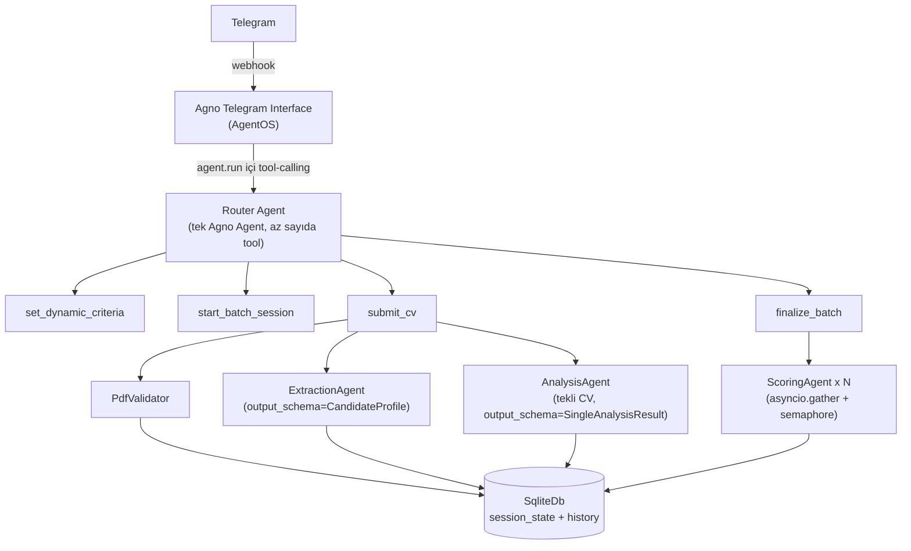
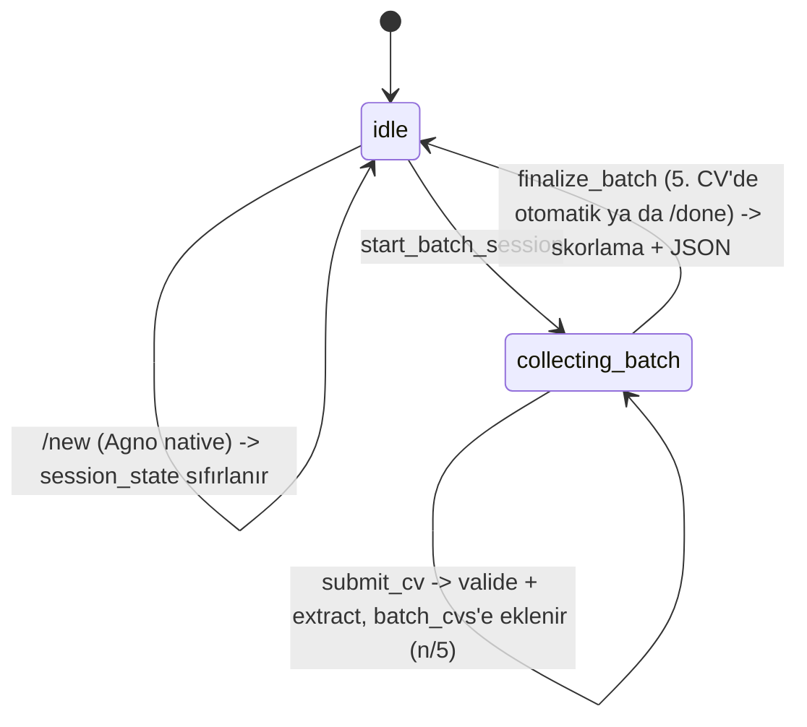

# Mimari Kararlar — telegram-ai-hr-bot

Bu doküman, "Yapay Zeka Destekli Dinamik Telegram İK ve Sohbet Botu" ödevi için alınan
mimari kararları ve gerekçelerini kayıt altına alır. Kod yazılmadan önce hazırlanmıştır;
amaç hem geliştirme sırasında referans olmak hem de mülakat savunmasında "neden böyle
tasarladın" sorularına net cevap verebilmektir.

## 1. Genel Bakış

Bot iki modda çalışır:

1. **Genel sohbet** — bağlamı (chat history) koruyan serbest sohbet.
2. **İK modu** — kullanıcının serbest metinle tanımladığı dinamik kriterlere göre CV
   analizi: tekli CV için nitel rapor, çoklu CV (maks. 5) için karşılaştırmalı skorlama.

## 2. Teknoloji Seçimleri

| Katman | Seçim | Gerekçe |
|---|---|---|
| Dil | Python 3.11+ | Agno framework'ü Python-native; ödevin izin verdiği 3 dilden biri. |
| Agent framework | **Agno** | `output_schema` ile yapılandırılmış çıktı, model-sağlayıcı soyutlaması, hazır Telegram interface'i. (LangChain ile karşılaştırma sohbet geçmişinde yapıldı.) |
| Telegram bağlantısı | **Agno `AgentOS` + `Telegram` interface** | Kullanıcı tercihi: hazır webhook/session altyapısını kullanmak. Bkz. §7 "Bilinen Riskler" — bu seçimin bilinen bir sınırlaması var ve B Planı dokümante edilmiştir. |
| LLM sağlayıcı | **OpenAI (başlangıç) → Ollama (sonra)** | Geliştirme hızı için önce OpenAI; `MODEL_PROVIDER` env değişkeniyle tek satır değişiklikle Ollama'ya geçilecek şekilde soyutlanacak. |
| Veritabanı | **SQLite** (`agno.db.sqlite.SqliteDb`) | Sıfır altyapı, yerel geliştirme için yeterli; session/memory zaten Agno tarafından bu üzerinden yönetiliyor. |
| PDF işleme | `pypdf` | Bozuk/şifreli PDF tespiti (`PdfReadError`) + metin çıkarımı için yeterli ve framework'ten bağımsız. |
| Konteynerleştirme | v1'de **yok** | Kullanıcı kararı: önce fonksiyonel kapsam tamamlanacak, Docker sonraki iterasyonda eklenecek. |

## 3. Sistem Mimarisi



**Katman sorumlulukları:**

- **Telegram Interface (Agno)**: webhook alma, mesaj/medya indirme, session_id/user_id
  eşleme, streaming yanıt. Hazır, yazılmayacak.
- **Router Agent**: Telegram'a bağlı tek Agno `Agent`. Az sayıda, net isimli tool'a
  sahip; asıl "akıllı" karar sadece *hangi tool çağrılacağı*. Tool içindeki mantık
  tamamen deterministik Python'dır (bkz. §5) — kararlılık gereksinimini LLM'in
  tutarlılığına değil, koda dayandırıyoruz.
- **İç ajanlar** (Extraction / Analysis / Scoring): Router'ın tool'ları tarafından
  düz fonksiyon çağrısıyla tetiklenen, kendi `output_schema`'sına sahip ayrı Agno
  `Agent` nesneleri. LLM-tarafından yönlendirilmezler; ne zaman çağrılacakları
  Python kodunda bellidir.
- **Servisler**: `PdfValidator`, metin çıkarım, eşzamanlılık yardımcıları — LLM'siz,
  test edilebilir, saf Python.

## 4. Konuşma Akışı (State Machine)

Durum `session_state` içinde tutulur (Agno `RunContext.session_state`, Telegram
chat/user başına otomatik izole edilir):

```python
session_state = {
    "mode": "idle",          # idle | collecting_batch
    "dynamic_criteria": None,  # list[str] | None
    "batch_cvs": [],           # bu oturumda toplanan, extract edilmiş adaylar
}
```



**Tetikleyiciler (kullanıcı tarafı):**
- Kriter tanımlama: serbest metin (örn. *"Bu CV'yi React tecrübesi ve temiz koda göre
  skorla"*) → agent `set_dynamic_criteria(criteria: list[str])` tool'unu çağırır.
- Tekli analiz: kriter tanımlıyken tek bir PDF gönderilir → `submit_cv` batch modda
  değilse otomatik olarak tekli analiz olarak işler.
- Toplu analiz: `/batch_analyze` komutu (veya "birden fazla CV göndereceğim" gibi
  doğal dil) → `start_batch_session`; ardından PDF'ler tek tek gönderilir; `/done`
  ya da 5. CV ile `finalize_batch` tetiklenir.
- Sıfırlama: Agno'nun native `/new` komutu session_state'i temizler (ayrıca özel bir
  `reset` tool'u yazmaya gerek yok).

## 5. Tool Tasarım İlkesi: "LLM router, kod garantör"

Değerlendirme kriteri #1 (*"hem tekli hem de çoklu modları kararlı çalıştırabilme"*)
gereği, mod geçişlerinin LLM'in her seferinde doğru karar vermesine bağlı olmasını
istemiyoruz. Bu yüzden:

- LLM'in sorumluluğu **sadece** hangi tool'un çağrılacağını seçmek.
- Her tool, çağrıldığı anda `session_state["mode"]`'u kendi içinde kontrol eder ve
  geçersiz bir çağrıyı (örn. batch modda değilken `finalize_batch` çağrılması)
  kullanıcıya açıklayıcı bir mesajla reddeder — LLM yanlış tool çağırsa bile sistem
  tutarsız bir duruma düşmez.
- `submit_cv` tool'unun imzasında dosya içeriği LLM'e argüman olarak yazdırılmaz;
  `RunContext` üzerinden o turun ekli medyasına erişilir (bkz. §7, doğrulanması
  gereken varsayım).

## 6. Veri Modelleri

**`CandidateProfile`** (LLM Extraction'ın ürettiği ortak şema — ödevin istediği
"farklı PDF formatlarını normalize eden JSON"):
```
full_name: str | None
skills: list[str]
work_experience: list[str]      # özetlenmiş deneyim girdileri
languages: list[str]
education: list[str]
```

**`SingleAnalysisResult`** (tekli CV nitel raporu):
```
candidate_name: str
strengths: list[str]
weaknesses: list[str]
recommendations: list[str]
markdown_report: str            # Telegram'a doğrudan gönderilecek Markdown
```

**`CandidateScore`** ve **`BatchAnalysisResult`** — ödev dokümanındaki JSON şemasıyla
**birebir aynı alan adları** kullanılacak (`status`, `processedCVCount`,
`userDefinedCriteria`, `topCandidates[].rank/candidateName/pdfFileName/
dynamicScores/averageScore/hrEvaluation`) — camelCase, ödev örneğine sadık kalınarak.

## 7. Asenkron / Paralel İşleme Stratejisi

- `finalize_batch` async bir tool; toplanan (≤5) CV için extraction+scoring
  `asyncio.gather` ile paralel çalıştırılır.
- Eşzamanlılık `asyncio.Semaphore(MAX_CONCURRENT_CV)` ile sınırlanır (varsayılan 3) —
  hem rate-limit koruması hem de "thread'lerin kilitlenmemesi" gereksinimini somut
  bir mekanizmayla karşılamak için.
- Tek bir CV'nin hata vermesi (bozuk PDF, extraction hatası) diğerlerini etkilemez;
  `asyncio.gather(..., return_exceptions=True)` + sonuçları filtreleme.

## 8. PDF Doğrulama

`submit_cv` içinde, extraction'dan **önce**, deterministik bir `PdfValidator`:
- Dosya `pypdf.PdfReader` ile açılamıyorsa (şifreli/bozuk) → kullanıcıya net hata,
  süreç orada kesilir (ödevin "Hata Kontrolü" gereksinimi).
- Açılabiliyor ama metin çıkmıyorsa (taranmış görüntü PDF vb.) → ayrı bir hata
  mesajıyla reddedilir (v1 kapsamında OCR yok).

## 9. Bilinen Riskler ve Açık Sorular

Bu proje "önce dokümantasyon, sonra implementasyon" prensibiyle ilerliyor; aşağıdaki
madde **implementasyona başlarken ilk doğrulanacak (spike) konu**:

> **Risk:** Agno'nun resmi Telegram interface dokümantasyonu, bir dosya (PDF) Telegram
> üzerinden geldiğinde bunun agent'a *"file input"* olarak aktarıldığını söylüyor,
> ancak bir tool'un bu ham dosya baytlarına `RunContext` üzerinden nasıl erişeceği
> **dokümante edilmemiş**. Bu, `submit_cv` tool'unun temel varsayımı.
>
> **Doğrulama planı:** İlk implementasyon adımı, tek bir PDF gönderip `RunContext`
> içeriğini loglayan minimal bir spike olacak.
>
> **B Planı:** Eğer dosya erişimi güvenilir/dokümante edilmemiş şekilde çalışmazsa,
> transport katmanı `python-telegram-bot`'a taşınır (Agno yalnızca agent/LLM katmanında
> kalır). Bu senaryo daha önce değerlendirilmiş ve mimari olarak izole edildiği için
> geçiş maliyeti sınırlı olacak şekilde tasarlandı (Router Agent'ın tool'ları servis
> katmanına ince bir arayüzle bağlı; transport değişse de `services/` ve `agents/`
> içindeki kod değişmeden kalır).

## 10. v1 Kapsamı

**Dahil:** Genel sohbet, dinamik kriter tanımlama, tekli CV nitel analiz, çoklu CV
(≤5) paralel skorlama + JSON çıktı, PDF validasyonu, OpenAI entegrasyonu, birim
testleri (PDF validator, session state guard'ları, domain modelleri — LLM çağrıları
mock'lanarak).

**Dahil değil (sonraki iterasyon):** Docker/docker-compose, Ollama'ya geçiş, OCR
destekli taranmış PDF okuma, çoklu kullanıcı yük testleri, mesaj bazlı rate limiting.

## 11. Klasör Yapısı

```
telegram-ai-hr-bot/
├── ARCHITECTURE.md
├── AGENTS.md
├── README.md
├── .env.example
├── requirements.txt
├── src/hrbot/
│   ├── main.py                  # AgentOS + Telegram interface bootstrap
│   ├── config.py                # env-tabanlı ayarlar
│   ├── models/model_factory.py  # OpenAI/Ollama seçici
│   ├── domain/                  # CandidateProfile, SingleAnalysisResult, BatchAnalysisResult
│   ├── services/                # pdf_validator, pdf_text_extractor, concurrency
│   ├── agents/                  # router agent + tools, extraction/analysis/scoring agent'ları
│   └── session/                 # session_state şeması + guard fonksiyonları
└── tests/
```
