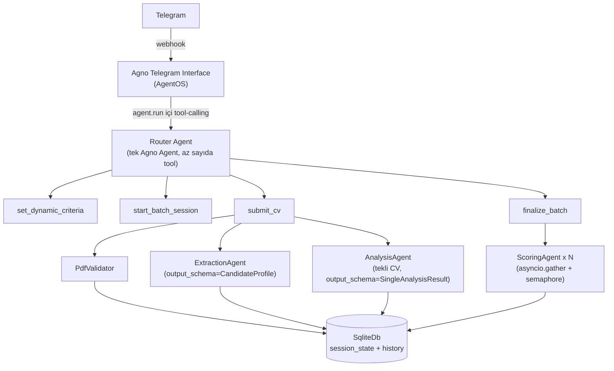
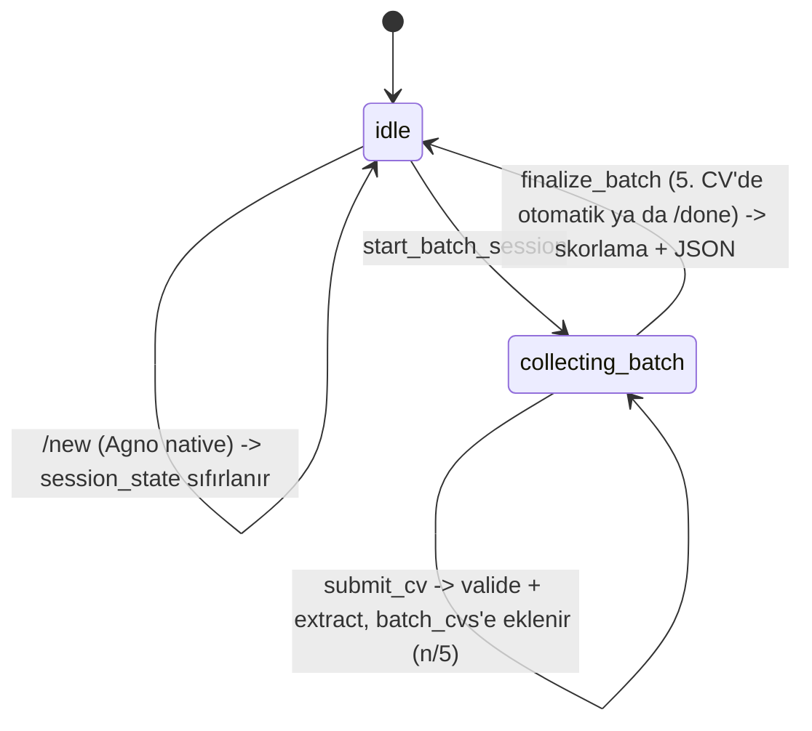

# Mimari Kararlar — telegram-ai-hr-bot

Bu doküman, "Yapay Zeka Destekli Dinamik Telegram İK ve Sohbet Botu" ödevi için alınan
mimari kararları ve gerekçelerini kayıt altına alır. Kod yazılmadan önce hazırlanmıştır;
amaç hem geliştirme sırasında referans olmak hem de mülakat savunmasında "neden böyle
tasarladın" sorularına net cevap verebilmektir.

## 1. Genel Bakış

Bot iki modda çalışır:

1. **Genel sohbet** — bağlamı (chat history) koruyan serbest sohbet.
2. **İK modu** — kullanıcının serbest metinle tanımladığı dinamik kriterlere göre CV
   analizi: tekli CV için nitel rapor, çoklu CV (maks. 5) için karşılaştırmalı skorlama.

## 2. Teknoloji Seçimleri

| Katman | Seçim | Gerekçe |
|---|---|---|
| Dil | Python 3.11+ | Agno framework'ü Python-native; ödevin izin verdiği 3 dilden biri. |
| Agent framework | **Agno** | `output_schema` ile yapılandırılmış çıktı, model-sağlayıcı soyutlaması, hazır Telegram interface'i. (LangChain ile karşılaştırma sohbet geçmişinde yapıldı.) |
| Telegram bağlantısı | **Agno `AgentOS` + `Telegram` interface** | Kullanıcı tercihi: hazır webhook/session altyapısını kullanmak. Dosya erişimi riski doğrulanıp çözüldü (bkz. §9). |
| LLM sağlayıcı | **OpenAI (başlangıç) → Ollama (sonra)** | Geliştirme hızı için önce OpenAI; `MODEL_PROVIDER` env değişkeniyle tek satır değişiklikle Ollama'ya geçilecek şekilde soyutlanacak. |
| Veritabanı | **SQLite** (`agno.db.sqlite.SqliteDb`) | Sıfır altyapı, yerel geliştirme için yeterli; session/memory zaten Agno tarafından bu üzerinden yönetiliyor. |
| PDF işleme | `pypdf` | Bozuk/şifreli PDF tespiti (`PdfReadError`) + metin çıkarımı için yeterli ve framework'ten bağımsız. |
| Konteynerleştirme | v1'de **yok** | Kullanıcı kararı: önce fonksiyonel kapsam tamamlanacak, Docker sonraki iterasyonda eklenecek. |

## 3. Sistem Mimarisi



**Katman sorumlulukları:**

- **Telegram Interface (Agno)**: webhook alma, mesaj/medya indirme, session_id/user_id
  eşleme, streaming yanıt. Hazır, yazılmayacak.
- **Router Agent**: Telegram'a bağlı tek Agno `Agent`. Az sayıda, net isimli tool'a
  sahip; asıl "akıllı" karar sadece *hangi tool çağrılacağı*. Tool içindeki mantık
  tamamen deterministik Python'dır (bkz. §5) — kararlılık gereksinimini LLM'in
  tutarlılığına değil, koda dayandırıyoruz.
- **İç ajanlar** (Extraction / Analysis / Scoring): Router'ın tool'ları tarafından
  düz fonksiyon çağrısıyla tetiklenen, kendi `output_schema`'sına sahip ayrı Agno
  `Agent` nesneleri. LLM-tarafından yönlendirilmezler; ne zaman çağrılacakları
  Python kodunda bellidir.
- **Servisler**: `PdfValidator`, metin çıkarım, eşzamanlılık yardımcıları — LLM'siz,
  test edilebilir, saf Python.

## 4. Konuşma Akışı (State Machine)

Durum `session_state` içinde tutulur (Agno `RunContext.session_state`, Telegram
chat/user başına otomatik izole edilir):

```python
session_state = {
    "mode": "idle",          # idle | collecting_batch
    "dynamic_criteria": None,  # list[str] | None
    "batch_cvs": [],           # bu oturumda toplanan, extract edilmiş adaylar
}
```



**Tetikleyiciler (kullanıcı tarafı):**
- Kriter tanımlama: serbest metin (örn. *"Bu CV'yi React tecrübesi ve temiz koda göre
  skorla"*) → agent `set_dynamic_criteria(criteria: list[str])` tool'unu çağırır.
- Tekli analiz: kriter tanımlıyken tek bir PDF gönderilir → `submit_cv` batch modda
  değilse otomatik olarak tekli analiz olarak işler.
- Toplu analiz: `/batch_analyze` komutu (veya "birden fazla CV göndereceğim" gibi
  doğal dil) → `start_batch_session`; ardından PDF'ler tek tek gönderilir; `/done`
  ya da 5. CV ile `finalize_batch` tetiklenir.
- Sıfırlama: Agno'nun native `/new` komutu session_state'i temizler (ayrıca özel bir
  `reset` tool'u yazmaya gerek yok).

## 5. Tool Tasarım İlkesi: "LLM router, kod garantör"

Değerlendirme kriteri #1 (*"hem tekli hem de çoklu modları kararlı çalıştırabilme"*)
gereği, mod geçişlerinin LLM'in her seferinde doğru karar vermesine bağlı olmasını
istemiyoruz. Bu yüzden:

- LLM'in sorumluluğu **sadece** hangi tool'un çağrılacağını seçmek.
- Her tool, çağrıldığı anda `session_state["mode"]`'u kendi içinde kontrol eder ve
  geçersiz bir çağrıyı (örn. batch modda değilken `finalize_batch` çağrılması)
  kullanıcıya açıklayıcı bir mesajla reddeder — LLM yanlış tool çağırsa bile sistem
  tutarsız bir duruma düşmez.
- `submit_cv` tool'unun imzasında dosya içeriği LLM'e argüman olarak yazdırılmaz;
  Agno'nun `files: Optional[Sequence[File]]` built-in tool parametresi ile o turun
  ekli medyası otomatik enjekte edilir (bkz. §9, doğrulandı).
- Router Agent'a bir **`pre_hook`** eklenir: o turda ekli dosya varsa `tool_choice`'u
  `submit_cv`'ye sabitler. Böylece "kullanıcı PDF gönderdiğinde `submit_cv`'yi çağır"
  artık LLM'in inisiyatifine bırakılan bir talimat değil, kod seviyesinde garanti
  edilen bir davranış — tek kalan LLM-bağımlı yönlendirme (metin bazlı kriter/batch
  komutları) kasıtlı olarak LLM'e bırakılmıştır çünkü onlar doğal dil serbestliği
  gerektiriyor (ödevin "serbest metin kriter" gereksinimi).

## 6. Veri Modelleri

**`PdfValidationResult`** (§8'deki 6 kontrolün tipli çıktısı — LLM'siz):
```
status: EMPTY_FILE | NOT_A_PDF | ENCRYPTED | CORRUPTED | EMPTY_PDF | NO_EXTRACTABLE_TEXT | VALID
extracted_text: str | None     # sadece status == VALID iken dolu
user_message: str | None       # sadece status != VALID iken dolu, Telegram'a birebir gönderilir
```

**`CandidateProfile`** (LLM Extraction'ın ürettiği ortak şema — ödevin istediği
"farklı PDF formatlarını normalize eden JSON"):
```
full_name: str | None
skills: list[str]
work_experience: list[str]      # özetlenmiş deneyim girdileri
languages: list[str]
education: list[str]
```

**`SingleAnalysisResult`** (tekli CV nitel raporu):
```
candidate_name: str
strengths: list[str]
weaknesses: list[str]
recommendations: list[str]
markdown_report: str            # Telegram'a doğrudan gönderilecek Markdown
```

**`CandidateScore`** ve **`BatchAnalysisResult`** — ödev dokümanındaki JSON şemasıyla
**birebir aynı alan adları** kullanılacak (`status`, `processedCVCount`,
`userDefinedCriteria`, `topCandidates[].rank/candidateName/pdfFileName/
dynamicScores/averageScore/hrEvaluation`) — camelCase, ödev örneğine sadık kalınarak.

## 7. Asenkron / Paralel İşleme Stratejisi

- `finalize_batch` async bir tool; toplanan (≤5) CV için extraction+scoring
  `asyncio.gather` ile paralel çalıştırılır.
- Eşzamanlılık `asyncio.Semaphore(MAX_CONCURRENT_CV)` ile sınırlanır (varsayılan 3) —
  hem rate-limit koruması hem de "thread'lerin kilitlenmemesi" gereksinimini somut
  bir mekanizmayla karşılamak için.
- Tek bir CV'nin hata vermesi (bozuk PDF, extraction hatası) diğerlerini etkilemez;
  `asyncio.gather(..., return_exceptions=True)` + sonuçları filtreleme.

## 8. PDF Doğrulama

`submit_cv` içinde, extraction'dan (dolayısıyla **her türlü LLM çağrısından**) **önce**
çalışan, tamamen deterministik, LLM'siz bir `PdfValidator` servisi. Amaç iki yönlü:
(1) ödevin "hatalı format tespit ederse süreci kesip net hata mesajı dönmeli"
gereksinimini karşılamak, (2) geçersiz dosyalar için gereksiz API çağrısı yapmamak.

`PdfValidator.validate(content: bytes, filename: str) -> PdfValidationResult`,
sırayla şu kontrolleri yapar — **ilk başarısız kontrolde durur**, sonrakiler
çalışmaz:

| # | Kontrol | Nasıl | Durum kodu | Kullanıcıya dönen mesaj |
|---|---|---|---|---|
| 1 | Boş dosya | `len(content) == 0` | `EMPTY_FILE` | "Gönderdiğin dosya boş görünüyor." |
| 2 | Gerçekten PDF mi | dosya uzantısına **güvenilmez**; ilk 5 bayt `%PDF-` magic number kontrolü | `NOT_A_PDF` | "Bu dosya bir PDF değil gibi görünüyor. Lütfen CV'ni PDF formatında gönder." |
| 3 | Şifreli mi | `pypdf.PdfReader`, `reader.is_encrypted` → önce boş parolayla decrypt denenir, olmazsa | `ENCRYPTED` | "Bu PDF şifre korumalı, açamıyorum. Şifresiz bir kopya gönderir misin?" |
| 4 | Bozuk / açılamıyor | `PdfReadError` / `PdfStreamError` yakalanır | `CORRUPTED` | "PDF dosyası bozuk görünüyor, açamadım." |
| 5 | Sayfasız | yapısal olarak geçerli ama `len(reader.pages) == 0` | `EMPTY_PDF` | "Bu PDF'in içinde hiç sayfa yok." |
| 6 | Metin çıkarılamıyor | tüm sayfalardan `extract_text()` birleştirilir, toplam < 50 karakter | `NO_EXTRACTABLE_TEXT` | "Bu PDF'ten metin çıkaramadım (muhtemelen taranmış görüntü). Şu an yalnızca metin tabanlı PDF'leri işleyebiliyorum." |

Sadece **hepsi geçerse** `PdfValidationResult(status=VALID, extracted_text=...)`
döner ve extraction/analysis/scoring zincirine girilir. `filename` uzantısına hiç
güvenilmemesi bilinçli bir karar: kullanıcı `.jpg` bir dosyayı `cv.pdf` diye
yeniden adlandırıp gönderebilir, magic-number kontrolü bunu yakalar.

Bu servis LLM içermediği için `tests/test_pdf_validator.py` içinde **gerçek,
elle hazırlanmış bozuk/şifreli/boş/sahte-uzantılı örnek dosyalarla** birim testi
yazılacak — mock'a gerek yok, çünkü hiçbir dış çağrı (LLM, ağ) içermiyor.

## 9. Bilinen Riskler ve Açık Sorular

### 9.1 ÇÖZÜLDÜ — Dosya erişimi

> Önceki risk: bir tool'un Telegram'dan gelen PDF'in ham baytlarına nasıl erişeceği
> dokümante değildi. **Agno'nun resmi dokümantasyonu ve örnek kodları (`file_input_for_tool`,
> `media_input_for_tool`) üzerinden doğrulandı:** Agno, `images`/`videos`/`audios`/`files`
> parametrelerini "tool built-in parameters" olarak tanımlıyor ve o turun ekli medyasını
> otomatik enjekte ediyor. Yani `submit_cv(run_context, files: Optional[Sequence[File]] = None)`
> imzası yeterli — Telegram interface, gelen `Document`'ı otomatik olarak `File` tipine
> çevirip (`agent-os/interfaces/telegram/reference` — Media Support tablosu, maks. 20 MB)
> bu parametreye taşıyor. Spike'a gerek kalmadı, doğrudan bu şekilde implemente edilecek.
>
> **Ek karar:** Router Agent `send_media_to_model=False, store_media=True` ile
> yapılandırılacak — PDF'in ham baytları LLM'e (multimodal olarak) gönderilmez, sadece
> tool'a erişilebilir şekilde saklanır. Extraction tamamen bizim `pypdf` + Extraction
> Agent zincirimiz üzerinden yürür; modelin PDF'i "kendi başına okumaya" çalışıp tutarsız
> sonuç üretmesi engellenmiş olur.

### 9.2 Açık — Yarım kalmış batch oturumu

Kullanıcı `/batch_analyze` ile toplama moduna girip 5'ten az CV gönderip `/done`
yazmadan sohbeti bırakırsa, `session_state["mode"]` süresiz `collecting_batch`'te
kalır. v1'de bunu kabul edilebilir görüyoruz (kullanıcı `/new` ile sıfırlayabilir)
ama gerçek bir kusur: bir sonraki oturumda kullanıcı normal sohbet bekliyorken botun
"CV bekliyorum" moduna takılı kalması olası. **v1 kapsamına almadığımız ama not
düşülen iyileştirme:** oturum başına son aktivite zaman damgası tutup N dakika
işlemsizlikten sonra `collecting_batch`'i otomatik `idle`'a döndürmek.

### 9.3 Açık — Skorların kalibrasyonu

`finalize_batch`, her CV'yi **birbirinden habersiz, paralel** bir Scoring Agent
çağrısıyla puanlıyor (bkz. §7). Bu, ödevin "paralel işleme" gereksinimini karşılıyor
ama metodolojik bir zayıflık taşıyor: bir CV'ye verilen "85" puanı, başka bir paralel
çağrıda üretilen "85" ile tam olarak aynı ölçekte olmayabilir (LLM'ler bağımsız
çağrılarda hafif tutarsız kalibrasyon yapabilir). v1'de bunu kabul ediyoruz çünkü
alternatifi (tüm CV'leri tek bir çağırıda birlikte skorlamak) paralelliği ortadan
kaldırır ve ödevin "asenkron/paralel işleme" değerlendirme kriteriyle çelişir. Mülakat
savunmasında bu trade-off açıkça belirtilecek.

## 10. v1 Kapsamı

**Dahil:** Genel sohbet, dinamik kriter tanımlama, tekli CV nitel analiz, çoklu CV
(≤5) paralel skorlama + JSON çıktı, PDF validasyonu, OpenAI entegrasyonu, birim
testleri (PDF validator, session state guard'ları, domain modelleri — LLM çağrıları
mock'lanarak).

**Dahil değil (sonraki iterasyon):** Docker/docker-compose, Ollama'ya geçiş, OCR
destekli taranmış PDF okuma, çoklu kullanıcı yük testleri, mesaj bazlı rate limiting.

## 11. Klasör Yapısı

```
telegram-ai-hr-bot/
├── ARCHITECTURE.md
├── AGENTS.md
├── README.md
├── .env.example
├── requirements.txt
├── src/hrbot/
│   ├── main.py                  # AgentOS + Telegram interface bootstrap
│   ├── config.py                # env-tabanlı ayarlar
│   ├── models/model_factory.py  # OpenAI/Ollama seçici
│   ├── domain/                  # CandidateProfile, SingleAnalysisResult, BatchAnalysisResult
│   ├── services/                # pdf_validator, pdf_text_extractor, concurrency
│   ├── agents/                  # router agent + tools, extraction/analysis/scoring agent'ları
│   └── session/                 # session_state şeması + guard fonksiyonları
└── tests/
```
