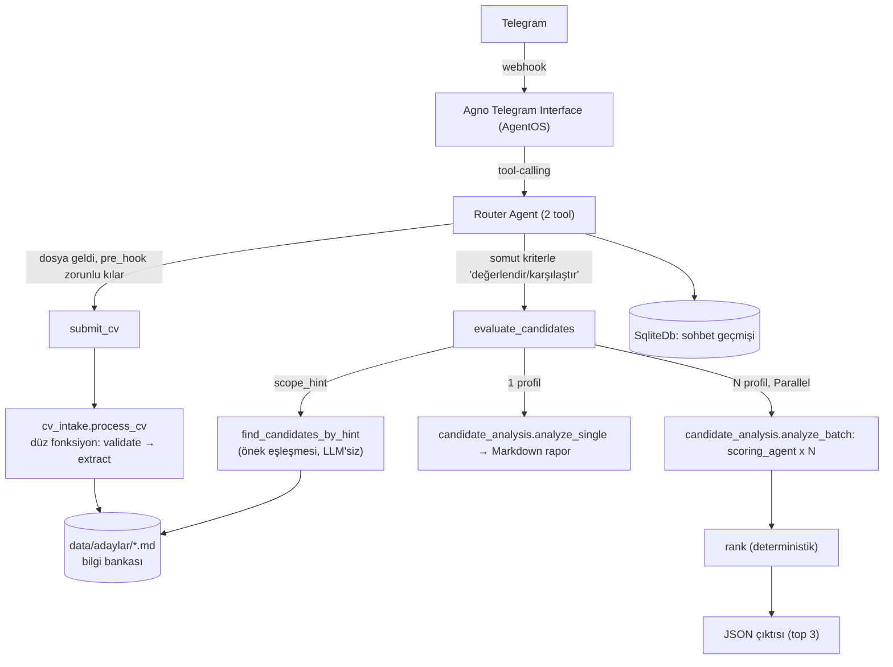
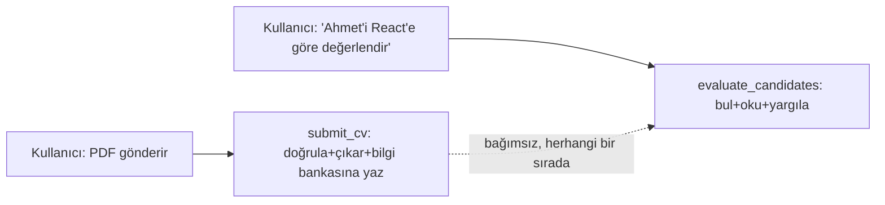
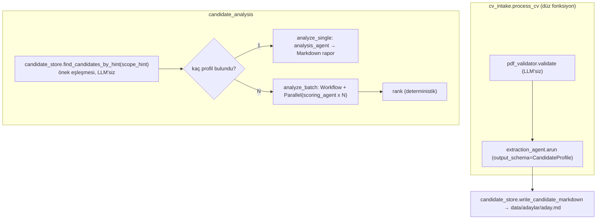

# Mimari Kararlar — telegram-ai-hr-bot

Bu doküman, "Yapay Zeka Destekli Dinamik Telegram İK ve Sohbet Botu" ödevi için alınan
mimari kararları ve gerekçelerini kayıt altına alır. Kod yazılmadan önce hazırlanmıştır;
amaç hem geliştirme sırasında referans olmak hem de mülakat savunmasında "neden böyle
tasarladın" sorularına net cevap verebilmektir.

> **Çalışma ilkeleri (KISS, aşamalı geliştirme, best-practice zorunluluğu) için
> `AGENTS.md` §0'a bakınız.** Bu ilkeler tüm projede geçerlidir, burada tekrar
> edilmez.

## 1. Genel Bakış

Bot iki modda çalışır:

1. **Genel sohbet** — bağlamı (chat history) koruyan serbest sohbet.
2. **İK modu** — kullanıcının serbest metinle tanımladığı dinamik kriterlere göre CV
   analizi: tekli CV için nitel rapor, çoklu CV (maks. 5) için karşılaştırmalı skorlama.

## 2. Teknoloji Seçimleri

| Katman | Seçim | Gerekçe |
|---|---|---|
| Dil | Python 3.11+ | Agno framework'ü Python-native; ödevin izin verdiği 3 dilden biri. |
| Agent framework | **Agno** | `output_schema` ile yapılandırılmış çıktı, model-sağlayıcı soyutlaması, hazır Telegram interface'i, native `Workflow` primitifi. |
| Telegram bağlantısı | **Agno `AgentOS` + `Telegram` interface** | Hazır webhook/session altyapısı. Dosya erişimi doğrulandı (bkz. §9.1). |
| CV intake | **Düz fonksiyon** (`cv_intake.process_cv`) | İki sabit adım (doğrula → çıkar), her zaman aynı sırada, tek bir erken-çıkış koşulu — `Workflow` burada gereksiz ağırlık; bkz. §6. |
| Çoklu değerlendirme | **Agno `Workflow` + `Parallel`** (`candidate_analysis.analyze_batch`) | Burada gerçekten gerekli: N adayın eşzamanlı skorlanması, elle `asyncio.gather` yazmadan. |
| Aday deposu | **Dosya tabanlı bilgi bankası** (`data/adaylar/*.md`) + deterministik önek eşleşmesi (`candidate_store.find_candidates_by_hint`) | Bkz. §6, §9.3 — `session_state` üzerinde bir state machine kurmak yerine, kalıcı/sorgulanabilir tek gerçek kaynak dosya sisteminde tutuluyor. `FilesystemContextProvider` denendi, canlı testte `Answer.results` boş döndü — LLM'siz, deterministik eşleşmeye geçildi. |
| LLM sağlayıcı | **OpenAI (başlangıç) → Ollama (sonra)** | `MODEL_PROVIDER` env değişkeniyle tek satır değişiklikle geçiş. |
| Veritabanı | **SQLite** (`agno.db.sqlite.SqliteDb`) | Sıfır altyapı; `AgentOS(db=...)` seviyesinde tanımlanır, tüm bileşenlere otomatik atanır. |
| PDF işleme | `pypdf` | Doğrulama + metin çıkarımı, framework'ten bağımsız. |
| Paralellik | **Agno `Parallel` step** (native, limitsiz) | Elle `asyncio.Semaphore` yazmak yerine framework'ün kendi mekanizması. |
| Konteynerleştirme | v1'de **yok** | Bkz. §11. |

## 3. Sistem Mimarisi



**Süreç sorumlulukları** (teknik katman değil, iş süreci bazlı — tek proje, tek
domain: bir HR agent'ın CV işleme süreci; bkz. §12):

- **Telegram Interface (Agno)**: webhook, medya indirme, session eşleme. Hazır.
- **Router Agent** (`main.py`): iki tool — `submit_cv` (intake'i tetikler) ve
  `evaluate_candidates` (analizi tetikler). Kararlılık gereksinimini LLM'in
  tutarlılığına değil koda dayandırıyoruz.
- **Intake süreci** (`cv_intake.py`): bir CV'yi doğrulama+çıkarmanın tek tarifi —
  düz fonksiyon, `Workflow` değil (bkz. §6).
- **Bilgi bankası** (`candidate_store.py` + `data/adaylar/*.md`): tek gerçek veri
  kaynağı ve ona ait dosya G/Ç'si — hem intake hem analiz bunu kullanır.
- **Analiz süreci** (`candidate_analysis.py`): bilgi bankasından okunan profil(ler)i
  kullanıcının kriterlerine göre değerlendirir — tekli (Markdown) ve çoklu
  (`Workflow`+`Parallel`, JSON) tek dosyada, çünkü ikisi de aynı sürecin
  dallanmaları.
- **`pdf_validator.py`**: LLM'siz, saf Python doğrulama.
- **`models.py`**: tüm Pydantic şemaları — ayrı bir paket değil, tek dosya.

## 4. Konuşma Akışı

**`session_state` bu pipeline için kullanılmıyor** — bkz. `AGENTS.md` §0 madde 6.
Önceki bir tasarım turunda bir state machine (`mode`, `set_dynamic_criteria`,
`start_batch_session`, `finalize_batch`, `pending_profile`) denenmiş, kullanıcı
geri bildirimiyle bilinçli olarak terk edilmiştir: kriterler "hatırlanan" bir durum
değil, her değerlendirme isteğiyle birlikte taze gelen bir argüman; adaylar
session'a değil dosya sistemine yazılıyor.



**Tetikleyiciler:**
- PDF geldiğinde → `pre_hook` LLM'i `submit_cv`'ye zorlar (deterministik, kod garantili).
- Kullanıcı bir/birden fazla adayı kriterleriyle değerlendirmek istediğinde → LLM
  `evaluate_candidates`'ı çağırır, kriterleri ve (varsa) aday ipucunu o anki
  cümleden çıkarıp argüman olarak geçer.

Bu iki tetikleyici **birbirinden bağımsızdır** — hangi sırayla gelirse gelsin çalışır:
CV önce gelip sonra değerlendirme istenebilir, ya da zaten bilgi bankasındaki
adaylar için doğrudan değerlendirme istenebilir.

## 5. Tool Tasarım İlkesi: "LLM router, kod garantör"

- LLM'in sorumluluğu **sadece** hangi tool'un çağrılacağı ve hangi argümanlarla.
- `submit_cv`'nin dosya geldiğinde çağrılması `pre_hook` ile kod seviyesinde garanti
  edilir (bkz. §9.1) — LLM'in inisiyatifine bırakılmaz.
- `evaluate_candidates`'ın **her adımı** (adayı bulma, kaç profil bulundu →
  tekli/çoklu dallanma, ortalama hesabı, sıralama) saf Python — LLM'e bırakılmaz.
  Adayı bulma bile artık deterministik (bkz. §9.3) — sadece "kim/kimlerle
  ilgileniliyor" ve kriterler LLM'in kararı.
- Her iki tool da tek bir süreç modülüne (`cv_intake` ya da `candidate_analysis`)
  devrediyor — adım sırası kod tarafından sabit, LLM'e bırakılmaz.

## 6. CV İşleme — İki Süreç, Ortak Bilgi Bankası

**Kilit karar:** Sistem, "domain" ya da teknik katman (agent/service/workflow)
değil, **iki bağımsız süreç** etrafında organize ediliyor — tek proje, tek HR
agent, iki süreci var:

1. **Intake süreci (`cv_intake.process_cv`)** — bir CV geldiğinde, kriter olsun
   olmasın, **her zaman** çalışır: doğrular, çıkarır. `submit_cv` sonucu bilgi
   bankasına (`data/adaylar/<slug>.md`) yazar.
2. **Analiz süreci (`candidate_analysis.analyze_single/analyze_batch`)** —
   kullanıcı somut kriterlerle bir değerlendirme isteğinde bulunduğunda çalışır:
   bilgi bankasından ilgili aday(lar)ı **deterministik** bulur/okur, sayıya göre
   tekli ya da çoklu değerlendirmeye dallanır.



**Kritik tasarım kuralları:**

1. **Intake iki sabit adım, `Workflow` değil:** doğrula → çıkar, hep aynı sırada,
   tek bir erken-çıkış koşulu (`(None, hata_mesajı)` dön). Bu, düz bir `if/return`
   ile ifade ediliyor — Agno `Workflow`'un `StepOutput(stop=True)` + izlenmesi
   gereken `step_results[-1].stop` mekanizması (bkz. §9.2) burada gereksiz
   ağırlıktı, kaldırıldı. `Workflow`, gerçekten paralel işlem gerektiren analiz
   sürecinde (madde 5) hâlâ kullanılıyor.
2. **Hata/başarı ayrımı tuple ile:** `process_cv`, `(profile, None)` ya da
   `(None, hata_mesajı)` döner — `isinstance` ile tahmin yürütmek yerine (önceki
   bir turda tam olarak bu hataya düşülmüştü).
3. **Structured output:** `extraction_agent`, `output_schema=CandidateProfile` ile
   çalışır; çıktısı tipli bir Pydantic nesnesi olarak döner.
4. **Bilgi bankası formatı:** her aday `data/adaylar/<slug>.md` — insan/LLM okunaklı
   Markdown. JSON değil, çünkü okuyan taraf zaten bir LLM (`analysis_agent`/
   `scoring_agent`) — Markdown onlar için doğal girdi.
5. **Adayı bulma da okuma da deterministik:** `evaluate_candidates`,
   `candidate_store.find_candidates_by_hint(scope_hint)` çağırır (§9.3) — isim
   eşleştirmesi kelime-önek karşılaştırmasıyla (Türkçe hâl eklerini tolere eder),
   LLM'siz. Bulunan dosyaların **tam içeriği** düz Python ile (`Path.read_text()`)
   okunur — kesilmiş bir `snippet`'e ya da LLM'in sentezlediği bir özete
   güvenilmez, yargılama tam metinle yapılır.
6. **Tekli/çoklu ayrımı bir mod değil, bir sayım:** bulunan profil sayısı 1 ise
   nitel analiz, N ise paralel skorlama + sıralama — aynı `candidate_analysis.py`
   içinde iki fonksiyon, ayrı komutlara gerek yok.
7. **Batch'te `Workflow`+`Parallel` gerçekten gerekli:** her aday için ayrı bir
   dal `scoring_agent`'ı eşzamanlı çalıştırır; ardından deterministik bir `rank`
   adımı `averageScore`'u Python'da hesaplar (LLM'e bırakılmaz) ve ilk 3'ü seçer.
   Eski kod bunu `_ScoreCandidateExecutor`/`_RankTop3Executor` diye iki class ile
   yapıyordu (her biri tek bir `__call__` sarmalıyordu) — closure alan iki düz
   fonksiyona (`_score_step`, `_rank_step`) indirgendi.

## 7. Veri Modelleri

**`PdfValidationResult`** (§8'deki 6 kontrolün tipli çıktısı — LLM'siz):
```
status: EMPTY_FILE | NOT_A_PDF | ENCRYPTED | CORRUPTED | EMPTY_PDF | NO_EXTRACTABLE_TEXT | VALID
extracted_text: str | None
user_message: str | None
```

**`CandidateProfile`** (LLM Extraction'ın ürettiği ortak şema — kullanıcının paylaştığı
zengin bir JSON şemasından KISS gereği seçilmiş, **düz** — nested obje/enum yok —
bir alt küme):
```
full_name, title, email, phone, location: str | None
links: list[str]
total_experience_years: float | None
work_model, employment_type, notice_period, military_status: str | None
skills, certifications, work_experience, education, languages: list[str]
```

**`SingleAnalysisResult`**:
```
candidate_name: str
strengths: list[str]
weaknesses: list[str]
recommendations: list[str]
markdown_report: str
```

**`CandidateScore`** ve **`BatchAnalysisResult`** — ödev dokümanındaki JSON şemasıyla
birebir aynı alan adları (`status`, `processedCVCount`, `userDefinedCriteria`,
`topCandidates[].rank/candidateName/pdfFileName/dynamicScores/averageScore/hrEvaluation`).
`dynamicScores` değerleri `Field(ge=0, le=100)` ile kısıtlanır. `candidateName` boş
dönerse dosya adı fallback olarak kullanılır.

## 8. PDF Doğrulama

`cv_intake.process_cv`'nin **ilk adımı**, her türlü LLM çağrısından **önce**
çalışan, tamamen deterministik `pdf_validator.validate()` fonksiyonudur:

| # | Kontrol | Nasıl | Durum kodu |
|---|---|---|---|
| 1 | Boş dosya | `len(content) == 0` | `EMPTY_FILE` |
| 2 | Gerçekten PDF mi | ilk 5 bayt `%PDF-` magic number (uzantıya güvenilmez) | `NOT_A_PDF` |
| 3 | Şifreli mi | `reader.is_encrypted`, boş parola denemesi | `ENCRYPTED` |
| 4 | Bozuk / açılamıyor | `PdfReadError`/`PdfStreamError` | `CORRUPTED` |
| 5 | Sayfasız | `len(reader.pages) == 0` | `EMPTY_PDF` |
| 6 | Metin çıkarılamıyor | birleşik metin < 50 karakter | `NO_EXTRACTABLE_TEXT` |

Sadece hepsi geçerse `extracted_text` doldurulur. `tests/test_pdf_validator.py`
gerçek, elle hazırlanmış örnek dosyalarla test eder — mock'a gerek yok.

## 9. Bilinen Riskler ve Doğrulanan Mekanizmalar

### 9.1 ÇÖZÜLDÜ — Dosya erişimi

Agno, `images`/`videos`/`audios`/`files` parametrelerini "tool built-in parameters"
olarak tanımlıyor, o turun ekli medyasını otomatik enjekte ediyor —
`submit_cv(run_context, files: Optional[Sequence[File]] = None)` yeterli. Router
Agent `send_media_to_model=False, store_media=True` ile yapılandırılır — PDF ham
baytları LLM'e gönderilmez, extraction tamamen `pypdf` + Extraction Agent
zincirimiz üzerinden yürür.

### 9.2 TARİHSEL — Workflow'un `stop=True` durumu (artık intake'te kullanılmıyor)

Kurulu Agno paketinde (`agno==2.8.6`) izole, LLM'siz bir test workflow'uyla elle
doğrulandı: bir adım `StepOutput(stop=True)` döndürdüğünde, sonraki adımlar hiç
çalışmıyor ve `WorkflowRunOutput.step_results[-1].stop == True` oluyor —
`RunStatus` her iki durumda da `completed` kaldığı için ona bakılamaz,
`step_results[-1].stop` doğru ve tek güvenilir kontrol. **Bu doğru ama ekstra bir
bilgi yükü** (çağıran tarafın Agno'nun bu iç detayını bilmesi gerekiyordu) — intake
artık `Workflow` kullanmadığı için (bkz. §6 madde 1) bu mekanizmaya gerek kalmadı,
düz bir `(None, hata_mesajı)` dönüşü yeterli. Not, `Workflow`'un ne zaman gerçekten
gerekli olduğunu (batch skorlama, §6 madde 7) ne zaman olmadığını (intake)
ayırt edebilmek için tutuluyor.

### 9.3 TERK EDİLDİ — `FilesystemContextProvider` canlı testte `Answer.results` boş döndü

Kurulu pakette `FilesystemContextProvider.query()`/`aquery(question: str) -> Answer`
metotları çağrılabiliyordu (`Answer(results: list[Document], text: str | None)`) ve
statik/izole testte makul görünüyordu — ama **gerçek bir LLM ile canlı testte**
`aquery("Kazım Timuçin Utkan")` şu sonucu verdi: `results=[]`, `text="## Kazım
Timuçin Utkan\n\n..."` (dosyanın tam içeriğini kendi sentezlediği bir cevaba
gömmüş). `evaluate_candidates` sadece `results`'ı okuyordu, bu yüzden bulunan
aday hep "bulamadım" olarak raporlandı. `text`'i kullanmak da bir seçenekti ama
tasarım ilkesiyle (madde 5: ham dosyadan yargıla, LLM'in sentezinden değil)
çelişirdi. **Karar:** `FilesystemContextProvider` tamamen kaldırıldı,
`candidate_store.find_candidates_by_hint()` ile değiştirildi — `scope_hint`
kelimeleri ile aday adı kelimeleri arasında önek eşleşmesi (Türkçe hâl eklerini
tolere eder: "Kazım" ~ "Kazımı"), LLM'siz, `list_all_candidates()`'ın üzerine
kurulu. Ölçek (birkaç test adayı) zaten agentic aramaya gerek bırakmıyordu.

### 9.4 ÇÖZÜLDÜ — Kalıcı veri yolları cwd'ye değil dosya konumuna göre sabit

`CANDIDATE_DIR = Path("data/adaylar")` ve `SqliteDb(db_file="data/agent-os.db")`
göreli yollardı — hangi dizinden çalıştırıldığına (`cd src && python main.py` mı,
repo kökünden `python src/main.py` mı) bağlı olarak **iki farklı, birbirinden
habersiz `data/` klasörü** oluşuyordu. Canlı testte tam olarak bu oldu: bot repo
kökünden çalıştırılmış, gerçek veri `./data/`'ya yazılmıştı; ayrı bir doğrulama
komutu `src/` içinden çalıştırılınca boş bir `src/data/` oluşturdu ve hiçbir aday
bulamadı — mimari doğruydu, sadece yol çözümü cwd'ye bağımlıydı. **Çözüm:** her
ikisi de artık `Path(__file__).resolve().parent.parent / "data"` ile, script'in
kendi konumuna göre, cwd'den bağımsız hesaplanıyor.

### 9.5 Açık — Skorların kalibrasyonu

Çoklu değerlendirmede her aday, birbirinden habersiz, paralel bir `scoring_agent`
çağrısıyla puanlanıyor. Bir CV'ye verilen "85" puanı başka bir paralel çağrıdaki
"85" ile tam aynı ölçekte olmayabilir. v1'de kabul ediliyor çünkü alternatifi
(hepsini tek çağrıda birlikte skorlamak) paralelliği ortadan kaldırır ve ödevin
"paralel işleme" kriteriyle çelişir.

## 10. Değerlendirme Kriterleri Karşılama Tablosu

| Ödev gereksinimi | Karşılık |
|---|---|
| §3: "tüm puanlama, detaylı analiz ve filtreleme... ortak JSON yapısı üzerinden" | `cv_intake.process_cv`'nin ürettiği tek, paylaşılan `CandidateProfile` — hem `analysis_agent` hem `scoring_agent` bunu (bilgi bankası üzerinden) kullanır. |
| §2: tekli CV → detaylı nitel rapor | `evaluate_candidates`, 1 profil bulununca `candidate_analysis.analyze_single` → `SingleAnalysisResult.markdown_report`. |
| §4: çoklu CV (≤5) → paralel işleme + top-3 JSON | `evaluate_candidates`, N profil bulununca `candidate_analysis.analyze_batch`: `Parallel(scoring_agent x N)` → rank → ödev JSON şeması. |
| §4: "asenkron veya paralel thread'ler üzerinde hızlıca" | Agno native `Parallel`, elle `asyncio` yazılmadan. |
| Kriter #1: kararlılık | `pre_hook` + deterministik tool içi mantık — LLM sadece hangi tool'u çağıracağına karar verir. |

## 11. v1 Kapsamı

**Dahil:** Genel sohbet, dosya tabanlı aday bilgi bankası, tekli CV nitel analiz,
çoklu CV paralel skorlama + JSON çıktı, PDF validasyonu, OpenAI entegrasyonu, birim
testleri (PDF validator — LLM çağrıları mock'lanarak diğerleri).

**Dahil değil (sonraki iterasyon):** Docker/docker-compose, Ollama'ya geçiş, OCR
destekli taranmış PDF okuma, çoklu kullanıcı yük testleri, mesaj bazlı rate limiting.

## 12. Klasör Yapısı

Teknik katman (agents/domain/services/workflows) yerine **süreç bazlı**, düz bir
`src/` — tek proje, tek HR agent, iki süreç (intake, analiz) + bunların paylaştığı
bilgi bankası ve şemalar. `__init__.py` yok, iç içe paket yok (bkz. `AGENTS.md` §0
madde 6a). Bir önceki turda `src/domain/`, `src/services/`, `src/agents/`,
`src/workflows/` (+ tek dosyalık `src/models/`) vardı — bu, kullanıcı geri
bildirimiyle bilinçli olarak terk edildi.

```
telegram-ai-hr-bot/
├── ARCHITECTURE.md
├── AGENTS.md
├── README.md
├── .env.example
├── requirements.txt
├── pytest.ini                  # pythonpath = src — testler için conftest.py/sys.path hack'i yerine
├── src/
│   ├── main.py                 # AgentOS + Telegram + submit_cv/evaluate_candidates wiring
│   ├── config.py
│   ├── model_factory.py        # LLM sağlayıcı seçimi (openai | ollama)
│   ├── models.py                # Tüm Pydantic şemaları (CandidateProfile, SingleAnalysisResult, …)
│   ├── pdf_validator.py         # LLM'siz, 6 kontrollü doğrulama
│   ├── candidate_store.py       # Bilgi bankası dosya G/Ç'si (yazma + okuma, hem intake hem analiz kullanır)
│   ├── cv_intake.py             # Intake süreci: doğrula → extraction_agent → normalize (düz fonksiyon)
│   └── candidate_analysis.py    # Analiz süreci: analysis_agent (tekli) + scoring_agent (Parallel, çoklu)
└── tests/
    └── test_pdf_validator.py
```

## 13. Aşamalı Uygulama Planı

| Aşama | Kapsam | Başarı Kriteri |
|---|---|---|
| **0 — Hello World** ✅ | Tool'suz Agent + Telegram interface. | `/start` → cevap. |
| **1 — Sohbet + Session** ✅ | `SqliteDb`, konuşma geçmişi. | Bota ismini söyle, sonra sorunca hatırlasın. |
| **2 — Bilgi bankası + Değerlendirme** | `pdf_validator`, `cv_intake.process_cv`, `candidate_analysis` (tekli+çoklu), `submit_cv`, `evaluate_candidates`, `candidate_store.find_candidates_by_hint`. | Gerçek bir CV gönder → bilgi bankasına eklendiği bildirilsin. "Bu adayı X'e göre değerlendir" de → Markdown rapor gelsin. 2+ CV gönderip "karşılaştır" de → JSON top-3 gelsin. Bozuk/şifreli PDF'te net hata mesajı. Kriter belirtmeden değerlendirme istenirse tool çağrılmadan kriter sorulsun. |
| **3 (opsiyonel) — Ollama, Docker** | `MODEL_PROVIDER=ollama` ile canlı test, Dockerfile/docker-compose. | Aynı senaryolar yerel Ollama modeliyle çalışır. |
