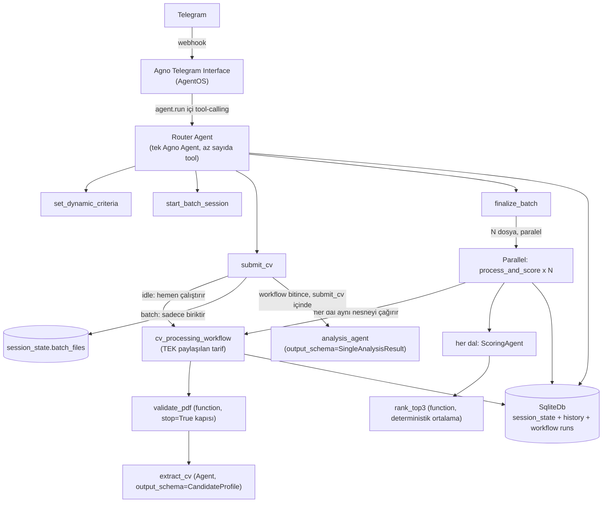
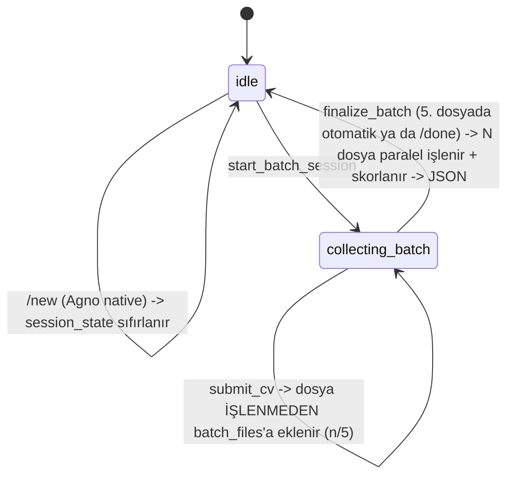
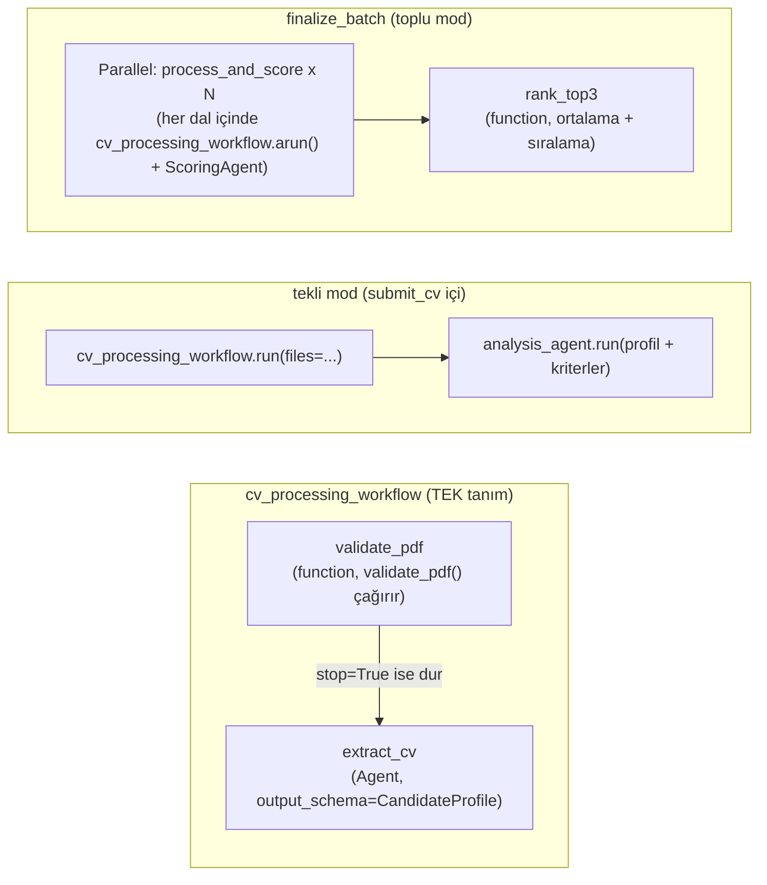

# Mimari Kararlar — telegram-ai-hr-bot

Bu doküman, "Yapay Zeka Destekli Dinamik Telegram İK ve Sohbet Botu" ödevi için alınan
mimari kararları ve gerekçelerini kayıt altına alır. Kod yazılmadan önce hazırlanmıştır;
amaç hem geliştirme sırasında referans olmak hem de mülakat savunmasında "neden böyle
tasarladın" sorularına net cevap verebilmektir.

> **Çalışma ilkeleri (KISS, aşamalı geliştirme, best-practice zorunluluğu) için
> `AGENTS.md` §0'a bakınız.** Bu ilkeler tüm projede geçerlidir, burada tekrar
> edilmez.

## 1. Genel Bakış

Bot iki modda çalışır:

1. **Genel sohbet** — bağlamı (chat history) koruyan serbest sohbet.
2. **İK modu** — kullanıcının serbest metinle tanımladığı dinamik kriterlere göre CV
   analizi: tekli CV için nitel rapor, çoklu CV (maks. 5) için karşılaştırmalı skorlama.

## 2. Teknoloji Seçimleri

| Katman | Seçim | Gerekçe |
|---|---|---|
| Dil | Python 3.11+ | Agno framework'ü Python-native; ödevin izin verdiği 3 dilden biri. |
| Agent framework | **Agno** | `output_schema` ile yapılandırılmış çıktı, model-sağlayıcı soyutlaması, hazır Telegram interface'i, native `Workflow` primitifi. (LangChain ile karşılaştırma sohbet geçmişinde yapıldı.) |
| Telegram bağlantısı | **Agno `AgentOS` + `Telegram` interface** | Kullanıcı tercihi: hazır webhook/session altyapısını kullanmak. Dosya erişimi riski doğrulanıp çözüldü (bkz. §10.1). |
| CV işleme pipeline'ı | **Tek, paylaşılan Agno `Workflow`** (`cv_processing_workflow`) | Bkz. §6 — Agno'nun ardışık çok-adımlı ajan zincirleri için resmi idiom'u budur (paralellik olmasa bile). Tekli ve toplu mod **aynı nesneyi** çalıştırır — tutarlılık KISS'in bir parçası (bkz. `AGENTS.md` §0). |
| LLM sağlayıcı | **OpenAI (başlangıç) → Ollama (sonra)** | Geliştirme hızı için önce OpenAI; `MODEL_PROVIDER` env değişkeniyle tek satır değişiklikle Ollama'ya geçilecek şekilde soyutlanacak. |
| Veritabanı | **SQLite** (`agno.db.sqlite.SqliteDb`) | Sıfır altyapı, yerel geliştirme için yeterli; Router Agent'ın session/memory'si ve Workflow'ların kendi geçmişi aynı dosyayı paylaşır. |
| PDF işleme | `pypdf` | Bozuk/şifreli PDF tespiti (`PdfReadError`) + metin çıkarımı için yeterli ve framework'ten bağımsız. |
| Paralellik | **Agno `Parallel` step** (native, limitsiz) | Bkz. §8 — batch en fazla 5 CV olduğundan elle `asyncio.Semaphore` yazmak yerine framework'ün kendi mekanizması kullanılıyor. |
| Konteynerleştirme | v1'de **yok** | Kullanıcı kararı: önce fonksiyonel kapsam tamamlanacak, Docker sonraki iterasyonda eklenecek (bkz. §13). |

## 3. Sistem Mimarisi



**Katman sorumlulukları:**

- **Telegram Interface (Agno)**: webhook alma, mesaj/medya indirme, session_id/user_id
  eşleme, streaming yanıt. Hazır, yazılmayacak.
- **Router Agent**: Telegram'a bağlı tek Agno `Agent`. Az sayıda, net isimli tool'a
  sahip; asıl "akıllı" karar sadece *hangi tool çağrılacağı*. Kararlılık gereksinimini
  LLM'in tutarlılığına değil, koda dayandırıyoruz.
- **`cv_processing_workflow`**: bir adayı doğrulama+çıkarma işleminin **tek, paylaşılan
  tarifi**. Hem tekli hem toplu mod bunu birebir aynı nesne olarak çağırır — detay §6.
- **Servisler**: `PdfValidator` — LLM'siz, test edilebilir, saf Python; `cv_processing_workflow`'un
  ilk adımı tarafından sarmalanıp çağrılıyor (bkz. §9).

## 4. Konuşma Akışı (State Machine)

Durum `session_state` içinde tutulur (Agno `RunContext.session_state`, Telegram
chat/user başına otomatik izole edilir):

```python
session_state = {
    "mode": "idle",          # idle | collecting_batch
    "dynamic_criteria": None,  # list[str] | None
    "batch_files": [],          # HAM, işlenmemiş dosyalar (extraction finalize_batch'e ertelenir)
}
```



**Tetikleyiciler (kullanıcı tarafı):**
- Kriter tanımlama: serbest metin (örn. *"Bu CV'yi React tecrübesi ve temiz koda göre
  skorla"*) → agent `set_dynamic_criteria(criteria: list[str])` tool'unu çağırır.
- Tekli analiz: kriter tanımlıyken tek bir PDF gönderilir → `submit_cv`, batch modda
  değilse `single_cv_workflow`'u **hemen** çalıştırır.
- Toplu analiz: `/batch_analyze` komutu (veya "birden fazla CV göndereceğim" gibi
  doğal dil) → `start_batch_session`; ardından PDF'ler tek tek gönderilir ama
  **işlenmez**, sadece biriktirilir; `/done` ya da 5. dosyada `finalize_batch`
  tetiklenir ve **hepsi aynı anda** işlenip skorlanır.
- Sıfırlama: Agno'nun native `/new` komutu session_state'i temizler (ayrıca özel bir
  `reset` tool'u yazmaya gerek yok).

## 5. Tool Tasarım İlkesi: "LLM router, kod garantör"

Değerlendirme kriteri #1 (*"hem tekli hem de çoklu modları kararlı çalıştırabilme"*)
gereği, mod geçişlerinin LLM'in her seferinde doğru karar vermesine bağlı olmasını
istemiyoruz. Bu yüzden:

- LLM'in sorumluluğu **sadece** hangi tool'un çağrılacağını seçmek.
- Her tool, çağrıldığı anda `session_state["mode"]`'u kendi içinde kontrol eder ve
  geçersiz bir çağrıyı (örn. batch modda değilken `finalize_batch` çağrılması)
  kullanıcıya açıklayıcı bir mesajla reddeder — LLM yanlış tool çağırsa bile sistem
  tutarsız bir duruma düşmez.
- `submit_cv` tool'unun imzasında dosya içeriği LLM'e argüman olarak yazdırılmaz;
  Agno'nun `files: Optional[Sequence[File]]` built-in tool parametresi ile o turun
  ekli medyası otomatik enjekte edilir (bkz. §10.1, doğrulandı).
- Router Agent'a bir **`pre_hook`** eklenir: o turda ekli dosya varsa `tool_choice`'u
  `submit_cv`'ye sabitler. Böylece "kullanıcı PDF gönderdiğinde `submit_cv`'yi çağır"
  artık LLM'in inisiyatifine bırakılan bir talimat değil, kod seviyesinde garanti
  edilen bir davranış.
- Tool'ların **içindeki** iş mantığı `cv_processing_workflow`'u çalıştırır (§6) — bu,
  kararlılığı bir kat daha güçlendiriyor: adım sırası kod tarafından sabit, LLM
  sadece kendi adımındaki (extract/analyze/score) tek görevi yapıyor.

## 6. CV İşleme Pipeline'ı — Tek, Paylaşılan `Workflow`

**Kilit karar:** Bir adayı işlemenin (doğrula → çıkar) **tek bir tanımı** var:
`cv_processing_workflow`. Tekli mod bunu bir kez çalıştırır; toplu mod **aynı
nesneyi** N aday için paralel çalıştırır. İki farklı mimari (biri düz kod, biri
Workflow) tutmak yerine tek, tutarlı bir tarif kullanılıyor — hem KISS hem Agno'nun
kendi idiom'u (ardışık çok-adımlı ajan zincirleri resmi örneklerde hep `Workflow`
ile kuruluyor, paralellik şart değil) bu sonuca çıkıyor; bkz. `AGENTS.md` §0.



| Parça | Adımlar | Ne zaman / nasıl çalışır | Çıktı |
|---|---|---|---|
| **`cv_processing_workflow`** | `validate_pdf` (function) → `extract_cv` (Agent) | Hem tekli hem toplu moddan **birebir aynı nesne** olarak çağrılır | `CandidateProfile` ya da doğrulama hatası (`stop=True` ile erken biter) |
| **tekli mod (`submit_cv` içi)** | `cv_processing_workflow.run(files=...)` → `analysis_agent.run(...)` | `submit_cv` içinde, **idle modda + kriter tanımlıysa**, **hemen**. Ayrı bir sarmalayıcı workflow YOK (KISS revizyonu): tekli ve toplu mod birebir aynı deseni kullanır — workflow + tek uzman ajan çağrısı | `SingleAnalysisResult.markdown_report` |
| **toplu (`finalize_batch`)** | `Parallel(process_and_score x N)` → `rank_top3` (function) | `finalize_batch` çağrıldığında; her dal **kendi içinde** `cv_processing_workflow.arun(files=[kendi_dosyası])` çağırır, sonra `ScoringAgent` | `BatchAnalysisResult` (ödev JSON şeması) |

**Kritik tasarım kuralları:**

1. **Toplu modda işleme ertelenir:** `submit_cv`, batch modda gelen dosyayı
   **işlemeden** `session_state["batch_files"]`'a ekler. Tüm doğrulama+çıkarım+skorlama,
   `finalize_batch` çağrıldığında, hepsi için aynı anda yapılır. Bilinen trade-off:
   erken hata geri bildirimi yok (5. CV bozuksa bunu ancak `/done` dedikten sonra
   öğrenirsiniz) — karşılığında tek, tutarlı bir pipeline. Bkz. §11.
2. **Kriter nasıl taşınır:** Kriter workflow'a hiç girmez — `cv_processing_workflow`
   yalnızca doğrula+çıkar yapar, kriterden habersizdir. Tekli modda `submit_cv`,
   workflow bittikten sonra kriteri profille birlikte `analysis_agent`'ın prompt'una
   yazar; toplu modda her paralel dalın closure'ı (`process_and_score`) kriteri
   aynı şekilde `scoring_agent`'a geçirir.
3. **Doğrulama kapısı:** `validate_pdf` adımı `PdfValidator`'ı (§9) çağıran bir
   function-executor. Geçersizse `StepOutput(content=hata_mesajı, stop=True)` döner —
   Agno'nun resmi "validation/quality gate" deseni; `cv_processing_workflow` o an
   durur, `extract_cv` hiç çalışmaz, hiçbir LLM çağrısı yapılmaz.
4. **Structured output zincirleme:** `extract_cv` adımı `output_schema=CandidateProfile`
   ile çalışan bir Agent step. Çıktısı çağırana **tipli Pydantic nesnesi** olarak
   döner (Agno bunu string'e çevirmiyor — resmi `structured-io-at-each-step-level`
   örneğiyle doğrulandı).
5. **`process_and_score` — toplu modun kalbi:** Her paralel dal, kendi dosyasını ve
   kriterleri closure'da taşıyan bir **fonksiyon** (class değil — KISS): bir fabrika
   fonksiyonu her dosya için `async def process_and_score(step_input)` üretir. İçinde
   **tekli modla birebir aynı** `cv_processing_workflow.arun(files=[file])` çağrısı
   yapılır, sonra `ScoringAgent` çağrılır. Agno'nun `Parallel`'ı bloktaki tüm dalları
   **aynı anda** çalıştırır (§8).
6. **`rank_top3`:** `Parallel` bloğunun tüm dal çıktıları toplu halde alınır,
   `averageScore` Python'da hesaplanır (LLM'e bırakılmaz), ilk 3 aday sıralanıp
   ödevin JSON şemasına dönüştürülür.

## 7. Veri Modelleri

**`validate_pdf` dönüşü** (§9'daki 6 kontrolün çıktısı — LLM'siz). KISS revizyonu:
ayrı bir sonuç sınıfı/enum yok, düz tuple:
```
(metin, hata) : tuple[str | None, str | None]   # tam olarak biri dolu
# hata, Telegram'a birebir gönderilecek Türkçe kullanıcı mesajıdır
```

**`CandidateProfile`** (LLM Extraction'ın ürettiği ortak şema — ödevin istediği
"farklı PDF formatlarını normalize eden JSON"):
```
full_name: str | None
skills: list[str]
work_experience: list[str]      # özetlenmiş deneyim girdileri
languages: list[str]
education: list[str]
```

**`SingleAnalysisResult`** (tekli CV nitel raporu):
```
candidate_name: str
strengths: list[str]
weaknesses: list[str]
recommendations: list[str]
markdown_report: str            # Telegram'a doğrudan gönderilecek Markdown
```

**`CandidateScore`** ve **`BatchAnalysisResult`** — ödev dokümanındaki JSON şemasıyla
**birebir aynı alan adları** kullanılacak (`status`, `processedCVCount`,
`userDefinedCriteria`, `topCandidates[].rank/candidateName/pdfFileName/
dynamicScores/averageScore/hrEvaluation`) — camelCase, ödev örneğine sadık kalınarak.
`dynamicScores` değerleri Pydantic `Field(ge=0, le=100)` ile 0-100 aralığına
kısıtlanır. `candidateName` boş dönerse (extraction isim bulamazsa) `pdfFileName`
fallback olarak kullanılır.

## 8. Paralellik: Agno `Parallel` (native, limitsiz)

Kullanıcı kararı: elle `asyncio.Semaphore` yazmak yerine Agno'nun `Parallel` step'i
kullanılıyor, eşzamanlılık sınırlanmıyor.

- `finalize_batch`'teki `Parallel(process_and_score x N)`, N ≤ 5 olduğu için en
  fazla 5 eşzamanlı `cv_processing_workflow` çalıştırması yapar — standart OpenAI
  rate limitlerinin çok altında.
- Tek bir CV'nin doğrulama/skorlama hatası diğerlerini etkilemez: her dal kendi
  `StepOutput(success=False, error=...)` durumunu taşır, `rank_top3` bunu filtreleyip
  geri kalanlarla devam eder.
- `Parallel`'ın kendisi HITL (`human_review`) desteklemiyor — bizim akışımızda zaten
  gerekmiyor, sorun değil.
- İlerideki bir iterasyonda gerçek bir eşzamanlılık sorunu gözlemlenirse (rate-limit
  hatası vb.), `Parallel` bloğunu elle gruplara bölmek (örn. 3'lü) tek satırlık bir
  değişiklik olacak şekilde tasarlandı — bu yüzden bugünden karmaşıklaştırmıyoruz.

## 9. PDF Doğrulama

`cv_processing_workflow`'un **ilk adımı** olan `validate_pdf_step` (function-executor),
extraction'dan (dolayısıyla **her türlü LLM çağrısından**) **önce** çalışan,
tamamen deterministik, LLM'siz `pdf_validator.validate_pdf()` fonksiyonunu çağırır. Amaç iki
yönlü: (1) ödevin "hatalı format tespit ederse süreci kesip net hata mesajı
dönmeli" gereksinimini karşılamak, (2) geçersiz dosyalar için gereksiz API çağrısı
yapmamak. Hem tekli hem toplu modda **aynı şekilde** çalışır çünkü ikisi de aynı
`cv_processing_workflow`'u kullanır.

`validate_pdf(content: bytes) -> tuple[str | None, str | None]` (yani `(metin, hata)`),
sırayla şu kontrolleri yapar — **ilk başarısız kontrolde durur**, sonrakiler
çalışmaz. Dosya adı parametre bile değil: uzantıya hiç güvenilmiyor (bkz. #2):

| # | Kontrol | Nasıl | Durum kodu | Kullanıcıya dönen mesaj |
|---|---|---|---|---|
| 1 | Boş dosya | `len(content) == 0` | `EMPTY_FILE` | "Gönderdiğin dosya boş görünüyor." |
| 2 | Gerçekten PDF mi | dosya uzantısına **güvenilmez**; ilk 5 bayt `%PDF-` magic number kontrolü | `NOT_A_PDF` | "Bu dosya bir PDF değil gibi görünüyor. Lütfen CV'ni PDF formatında gönder." |
| 3 | Şifreli mi | `pypdf.PdfReader`, `reader.is_encrypted` → önce boş parolayla decrypt denenir, olmazsa | `ENCRYPTED` | "Bu PDF şifre korumalı, açamıyorum. Şifresiz bir kopya gönderir misin?" |
| 4 | Bozuk / açılamıyor | `PdfReadError` / `PdfStreamError` yakalanır | `CORRUPTED` | "PDF dosyası bozuk görünüyor, açamadım." |
| 5 | Sayfasız | yapısal olarak geçerli ama `len(reader.pages) == 0` | `EMPTY_PDF` | "Bu PDF'in içinde hiç sayfa yok." |
| 6 | Metin çıkarılamıyor | tüm sayfalardan `extract_text()` birleştirilir, toplam < 50 karakter | `NO_EXTRACTABLE_TEXT` | "Bu PDF'ten metin çıkaramadım (muhtemelen taranmış görüntü). Şu an yalnızca metin tabanlı PDF'leri işleyebiliyorum." |

`validate_pdf_step`, `(metin, hata)` tuple'ını şuna çevirir:
- Hata varsa → `StepOutput(content=hata, stop=True)` — Agno'nun resmi
  "validation gate" deseni; workflow burada durur, sonraki adımlar hiç çalışmaz.
  Dışarıdan tespit: Agno'da ayrı bir "erken durdu" alanı yok (status `completed`
  kalır), `run_output.step_results[-1].stop` kontrol edilir (`workflows.stopped_early`).
- Hata yoksa → `StepOutput(content=metin)` — `extract_cv` adımına girdi olur.

`filename` uzantısına hiç güvenilmemesi bilinçli bir karar: kullanıcı `.jpg` bir
dosyayı `cv.pdf` diye yeniden adlandırıp gönderebilir, magic-number kontrolü bunu
yakalar.

`validate_pdf` LLM içermediği için `tests/test_pdf_validator.py` içinde
**gerçek, elle hazırlanmış bozuk/şifreli/boş/sahte-uzantılı örnek baytlarla** birim
testi yazıldı (kontrol başına bir test) — mock yok, çünkü hiçbir dış çağrı (LLM, ağ)
içermiyor.

## 10. Bilinen Riskler ve Açık Sorular

### 10.1 ÇÖZÜLDÜ — Dosya erişimi

> Önceki risk: bir tool'un Telegram'dan gelen PDF'in ham baytlarına nasıl erişeceği
> dokümante değildi. **Agno'nun resmi dokümantasyonu ve örnek kodları (`file_input_for_tool`,
> `media_input_for_tool`) üzerinden doğrulandı:** Agno, `images`/`videos`/`audios`/`files`
> parametrelerini "tool built-in parameters" olarak tanımlıyor ve o turun ekli medyasını
> otomatik enjekte ediyor. `submit_cv(run_context, files: Optional[Sequence[File]] = None)`
> imzası, hem tekli çağrıda (`files` doğrudan) hem toplu modda (`ProcessAndScoreExecutor`'ın
> `self.file`'ı zaten `submit_cv`'de alınan `files[0]`'dan geliyor) yeterli.
>
> **Ek karar:** Router Agent `send_media_to_model=False, store_media=True` ile
> yapılandırılacak — PDF'in ham baytları LLM'e (multimodal olarak) gönderilmez, sadece
> tool'a erişilebilir şekilde saklanır. Extraction tamamen bizim `pypdf` + Extraction
> Agent zincirimiz üzerinden yürür.
>
> **Aşama 2'de doğrulandı (kurulu kaynak + canlı test):** `Workflow.run(files=[...])`
> dosyaları her adımın `step_input.files`'ına taşıyor (`agno/workflow/workflow.py`:
> `shared_files`), Telegram interface'i dosyayı indirip `File(content=bytes,
> filename=...)` kuruyor (`agno/os/interfaces/telegram/helpers.py:85`). Bozuk baytla
> yapılan gerçek workflow koşusunda pipeline 1. adımda durdu, LLM'e hiç gidilmedi.
> Ek bulgular: dosyalar **her** adıma taşındığı için `extraction_agent`'a da
> `send_media_to_model=False` verildi (PDF baytları modele multimodal gitmesin);
> Telegram 20MB üzeri dosyayı hiç indirmiyor (`validate_pdf_step` boş `files`
> durumunu ele alıyor); sync tool'lar Agno tarafından `asyncio.to_thread`'e
> atıldığı için tool içindeki sync `workflow.run()` event loop'u bloklamıyor
> (ödevin "asenkron süreç" kriteri — bot diğer mesajlara yanıt vermeye devam eder).

### 10.2 Açık — Yarım kalmış batch oturumu

Kullanıcı `/batch_analyze` ile toplama moduna girip 5'ten az CV gönderip `/done`
yazmadan sohbeti bırakırsa, `session_state["mode"]` süresiz `collecting_batch`'te
kalır. v1'de bunu kabul edilebilir görüyoruz (kullanıcı `/new` ile sıfırlayabilir)
ama gerçek bir kusur: bir sonraki oturumda kullanıcı normal sohbet bekliyorken botun
"CV bekliyorum" moduna takılı kalması olası. **v1 kapsamına almadığımız ama not
düşülen iyileştirme:** oturum başına son aktivite zaman damgası tutup N dakika
işlemsizlikten sonra `collecting_batch`'i otomatik `idle`'a döndürmek.

### 10.3 Açık — Skorların kalibrasyonu

Toplu modda her CV, **birbirinden habersiz, paralel** bir `process_and_score`
dalıyla puanlanıyor (bkz. §6, §8). Bu, ödevin "paralel işleme" gereksinimini
karşılıyor ama metodolojik bir zayıflık taşıyor: bir CV'ye verilen "85" puanı, başka
bir paralel çağrıda üretilen "85" ile tam olarak aynı ölçekte olmayabilir (LLM'ler
bağımsız çağrılarda hafif tutarsız kalibrasyon yapabilir). v1'de bunu kabul ediyoruz
çünkü alternatifi (tüm CV'leri tek bir çağırıda birlikte skorlamak) paralelliği
ortadan kaldırır ve ödevin "asenkron/paralel işleme" değerlendirme kriteriyle
çelişir. Mülakat savunmasında bu trade-off açıkça belirtilecek.

### 10.4 Açık — Batch'te erken hata geri bildirimi yok

§6 madde 1'de belirtildiği gibi, toplu modda doğrulama `finalize_batch`'e kadar
ertelendiği için, 5 CV'den biri bozuksa kullanıcı bunu ancak hepsini gönderip
`/done` dedikten sonra öğrenir. Tek, tutarlı pipeline'ın (bkz. `AGENTS.md` §0)
bilinçli bedeli olarak kabul edildi.

## 11. v1 Kapsamı

**Dahil:** Genel sohbet, dinamik kriter tanımlama, tekli CV nitel analiz, çoklu CV
(≤5) paralel skorlama + JSON çıktı, PDF validasyonu, OpenAI entegrasyonu, birim
testleri (PDF validator, session state guard'ları, domain modelleri, workflow step
fonksiyonları — LLM çağrıları mock'lanarak).

**Dahil değil (sonraki iterasyon):** Docker/docker-compose, Ollama'ya geçiş, OCR
destekli taranmış PDF okuma, çoklu kullanıcı yük testleri, mesaj bazlı rate limiting,
aday bilgi bankası (`FilesystemContextProvider` — bkz. §13 Aşama 4).

## 12. Klasör Yapısı

**KISS revizyonu (Aşama 2, kullanıcı kararı):** alt klasör/paket YOK — `src/` altında
düz modüller. `__init__.py`, re-export, tek fonksiyonluk class, ayrı "domain/services"
katmanları kaldırıldı. Python, çalıştırılan script'in dizinini otomatik `sys.path`'e
ekler (`cd src && python main.py`); testler için `pytest.ini` → `pythonpath = src`.

```
telegram-ai-hr-bot/
├── ARCHITECTURE.md / AGENTS.md / README.md / TODO.md
├── .env.example
├── requirements.txt
├── pytest.ini              # pythonpath = src (conftest.py yerine)
├── src/
│   ├── main.py             # AgentOS + Telegram interface bootstrap
│   ├── config.py           # env-tabanlı ayarlar
│   ├── model_factory.py    # OpenAI/Ollama seçici
│   ├── schemas.py          # LLM çıktı şemaları (Pydantic — Agno output_schema gereksinimi)
│   ├── pdf_validator.py    # validate_pdf() → (metin, hata) — LLM'siz
│   ├── agents.py           # extraction_agent, analysis_agent (Aşama 3'te: scoring_agent)
│   ├── workflows.py        # cv_processing_workflow (Aşama 3'te: batch parçaları)
│   └── bot.py              # Router Agent + tool'ları + pre_hook
└── tests/
```

## 13. Aşamalı Uygulama Planı

`AGENTS.md` §0'daki "hello world önce, kompleksite gerektikçe" ilkesinin somut
karşılığı. Her aşama, bir öncekinin çalıştığı doğrulanmadan başlamaz.

| Aşama | Kapsam | Başarı Kriteri |
|---|---|---|
| **0 — Hello World** | Tek dosya, Agno `Agent` (tool'suz, en yalın hâliyle) + `Telegram` interface. Sadece BotFather token / webhook / (yerelde) ngrok bağlantısını uçtan uca doğrula. | Bota `/start` yaz, cevap gelsin. |
| **1 — Sohbet + Session** | `SqliteDb` eklenir, konuşma geçmişi çalışır hâle gelir. | Botla önce ismini paylaş, birkaç mesaj sonra sorunca hatırlasın. |
| **2 — Kriter + Tekli CV** | `set_dynamic_criteria`, `validate_pdf` (+ birim testleri), `cv_processing_workflow`, `extraction_agent`, `analysis_agent`, `submit_cv` (idle dalı: workflow + analysis_agent). | Gerçek bir CV PDF'i gönder, kriter söyle, Markdown rapor gelsin. Bozuk/şifreli/sahte-uzantılı PDF'te net hata mesajı gelsin. |
| **3 — Toplu CV + Paralel Skorlama** | `start_batch_session`, `submit_cv` (batch dalı — sadece biriktirme), `finalize_batch`, `ProcessAndScoreExecutor`, `scoring_agent`, `rank_top3`. `cv_processing_workflow` **değişmeden, aynen** yeniden kullanılır. | 2-5 CV gönder, `/done` yaz, ödev JSON formatında top-3 sonucu gelsin. |
| **4 (opsiyonel) — Aday bilgi bankası** | `data/adaylar/<aday>/` klasör yapısı (`cv_processing_workflow`'a üçüncü bir adım olarak eklenir) + `FilesystemContextProvider` ile Router'ın geçmiş adaylar hakkında soru cevaplayabilmesi. Ödevin 4 çekirdek gereksinimine dahil değil. | Daha önce işlenmiş bir aday hakkında soru sor, doğru cevap gelsin. |
| **5 (opsiyonel) — Ollama, Docker** | `MODEL_PROVIDER=ollama` ile canlı test, Dockerfile/docker-compose. | Aynı senaryolar (Aşama 2-3) yerel Ollama modeliyle tekrar çalışır. |
