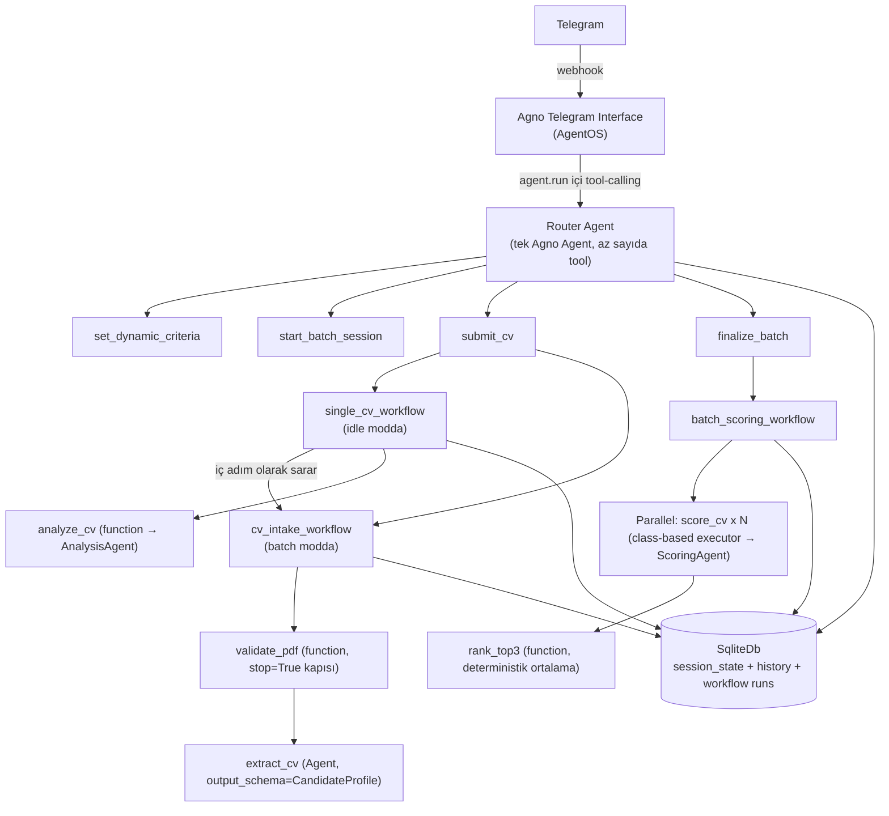
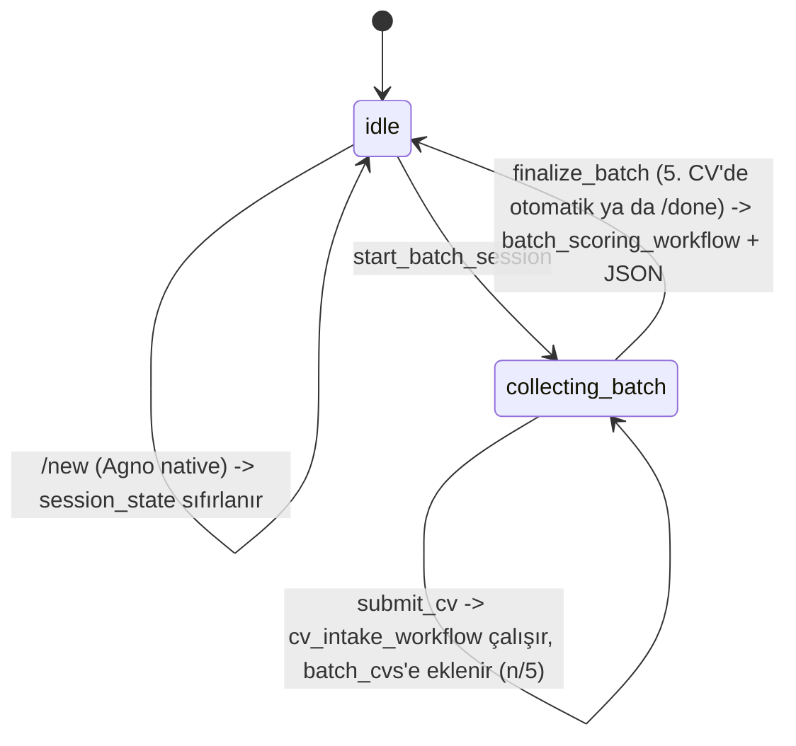
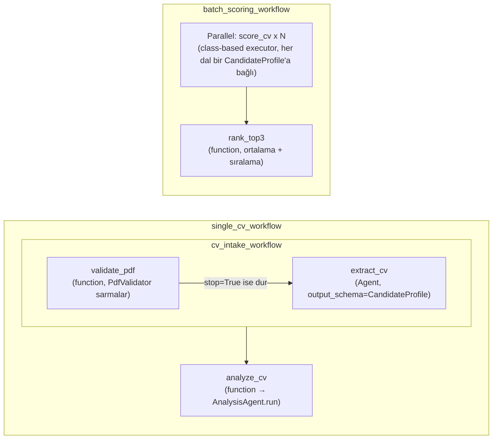

# Mimari Kararlar — telegram-ai-hr-bot

Bu doküman, "Yapay Zeka Destekli Dinamik Telegram İK ve Sohbet Botu" ödevi için alınan
mimari kararları ve gerekçelerini kayıt altına alır. Kod yazılmadan önce hazırlanmıştır;
amaç hem geliştirme sırasında referans olmak hem de mülakat savunmasında "neden böyle
tasarladın" sorularına net cevap verebilmektir.

## 1. Genel Bakış

Bot iki modda çalışır:

1. **Genel sohbet** — bağlamı (chat history) koruyan serbest sohbet.
2. **İK modu** — kullanıcının serbest metinle tanımladığı dinamik kriterlere göre CV
   analizi: tekli CV için nitel rapor, çoklu CV (maks. 5) için karşılaştırmalı skorlama.

## 2. Teknoloji Seçimleri

| Katman | Seçim | Gerekçe |
|---|---|---|
| Dil | Python 3.11+ | Agno framework'ü Python-native; ödevin izin verdiği 3 dilden biri. |
| Agent framework | **Agno** | `output_schema` ile yapılandırılmış çıktı, model-sağlayıcı soyutlaması, hazır Telegram interface'i, native `Workflow` primitifi. (LangChain ile karşılaştırma sohbet geçmişinde yapıldı.) |
| Telegram bağlantısı | **Agno `AgentOS` + `Telegram` interface** | Kullanıcı tercihi: hazır webhook/session altyapısını kullanmak. Dosya erişimi riski doğrulanıp çözüldü (bkz. §10.1). |
| CV işleme pipeline'ı | **Agno `Workflow`** (`Step`/`Parallel`, kod tarafından kontrol edilir) | Bkz. §6 — "sabit sıra + kural bazlı dallanma" ödevin CV işleme akışının tam tarifi; Agno'nun kendi resmi ayrımı ("Workflow = kararı kod verir, Team = kararı model verir") bizim "LLM router, kod garantör" ilkemizle birebir örtüşüyor. |
| LLM sağlayıcı | **OpenAI (başlangıç) → Ollama (sonra)** | Geliştirme hızı için önce OpenAI; `MODEL_PROVIDER` env değişkeniyle tek satır değişiklikle Ollama'ya geçilecek şekilde soyutlanacak. |
| Veritabanı | **SQLite** (`agno.db.sqlite.SqliteDb`) | Sıfır altyapı, yerel geliştirme için yeterli; Router Agent'ın session/memory'si ve Workflow'ların kendi geçmişi aynı dosyayı paylaşır. |
| PDF işleme | `pypdf` | Bozuk/şifreli PDF tespiti (`PdfReadError`) + metin çıkarımı için yeterli ve framework'ten bağımsız. |
| Paralellik | **Agno `Parallel` step** (native, limitsiz) | Bkz. §8 — batch en fazla 5 CV olduğundan elle `asyncio.Semaphore` yazmak yerine framework'ün kendi mekanizması kullanılıyor. |
| Konteynerleştirme | v1'de **yok** | Kullanıcı kararı: önce fonksiyonel kapsam tamamlanacak, Docker sonraki iterasyonda eklenecek. |

## 3. Sistem Mimarisi



**Katman sorumlulukları:**

- **Telegram Interface (Agno)**: webhook alma, mesaj/medya indirme, session_id/user_id
  eşleme, streaming yanıt. Hazır, yazılmayacak.
- **Router Agent**: Telegram'a bağlı tek Agno `Agent`. Az sayıda, net isimli tool'a
  sahip; asıl "akıllı" karar sadece *hangi tool çağrılacağı*. Tool'lar kendi işlerini
  elle değil, aşağıda tanımlanan **Workflow'ları çalıştırarak** yapar (bkz. §5, §6) —
  kararlılık gereksinimini LLM'in tutarlılığına değil, koda dayandırıyoruz.
- **Workflow'lar**: CV doğrulama → çıkarım → analiz/skorlama zincirinin **kod tarafından
  tanımlanmış, sabit sıralı** ifadesi. İçlerinde hem Agno `Agent` adımları (LLM'li) hem
  düz Python fonksiyon adımları (LLM'siz) karışık kullanılıyor. Detay §6.
- **Servisler**: `PdfValidator` — LLM'siz, test edilebilir, saf Python; bir Workflow
  step'i tarafından sarmalanıp çağrılıyor (bkz. §9).

## 4. Konuşma Akışı (State Machine)

Durum `session_state` içinde tutulur (Agno `RunContext.session_state`, Telegram
chat/user başına otomatik izole edilir):

```python
session_state = {
    "mode": "idle",          # idle | collecting_batch
    "dynamic_criteria": None,  # list[str] | None
    "batch_cvs": [],           # bu oturumda toplanan (CandidateProfile, pdfFileName) çiftleri
}
```



**Tetikleyiciler (kullanıcı tarafı):**
- Kriter tanımlama: serbest metin (örn. *"Bu CV'yi React tecrübesi ve temiz koda göre
  skorla"*) → agent `set_dynamic_criteria(criteria: list[str])` tool'unu çağırır.
- Tekli analiz: kriter tanımlıyken tek bir PDF gönderilir → `submit_cv` batch modda
  değilse `single_cv_workflow`'u çalıştırır.
- Toplu analiz: `/batch_analyze` komutu (veya "birden fazla CV göndereceğim" gibi
  doğal dil) → `start_batch_session`; ardından PDF'ler tek tek gönderilir; `/done`
  ya da 5. CV ile `finalize_batch` tetiklenir.
- Sıfırlama: Agno'nun native `/new` komutu session_state'i temizler (ayrıca özel bir
  `reset` tool'u yazmaya gerek yok).

## 5. Tool Tasarım İlkesi: "LLM router, kod garantör"

Değerlendirme kriteri #1 (*"hem tekli hem de çoklu modları kararlı çalıştırabilme"*)
gereği, mod geçişlerinin LLM'in her seferinde doğru karar vermesine bağlı olmasını
istemiyoruz. Bu yüzden:

- LLM'in sorumluluğu **sadece** hangi tool'un çağrılacağını seçmek.
- Her tool, çağrıldığı anda `session_state["mode"]`'u kendi içinde kontrol eder ve
  geçersiz bir çağrıyı (örn. batch modda değilken `finalize_batch` çağrılması)
  kullanıcıya açıklayıcı bir mesajla reddeder — LLM yanlış tool çağırsa bile sistem
  tutarsız bir duruma düşmez.
- `submit_cv` tool'unun imzasında dosya içeriği LLM'e argüman olarak yazdırılmaz;
  Agno'nun `files: Optional[Sequence[File]]` built-in tool parametresi ile o turun
  ekli medyası otomatik enjekte edilir (bkz. §10.1, doğrulandı).
- Router Agent'a bir **`pre_hook`** eklenir: o turda ekli dosya varsa `tool_choice`'u
  `submit_cv`'ye sabitler. Böylece "kullanıcı PDF gönderdiğinde `submit_cv`'yi çağır"
  artık LLM'in inisiyatifine bırakılan bir talimat değil, kod seviyesinde garanti
  edilen bir davranış.
- Tool'ların **içindeki** iş mantığı da artık if/else yerine bir **Workflow** çalıştırıyor
  (§6) — bu, kararlılığı bir kat daha güçlendiriyor: Workflow'un adım sırası da kod
  tarafından sabit, LLM sadece kendi adımındaki (extract/analyze/score) tek görevi yapıyor.

## 6. CV İşleme Pipeline'ı — Agno Workflow

Agno'nun `Workflow` primitifi tam olarak bizim ihtiyacımız: *"sabit sıra, kural bazlı
dallanma, kod tanımlı paralel dal"* için Agno'nun kendi resmi tavsiyesi Workflow'dur
(bkz. sohbet geçmişindeki `faq/workflow-vs-team` karşılaştırması). Üç workflow tanımlıyoruz:



| Workflow | Adımlar | Ne zaman çalışır | Girdi | Çıktı |
|---|---|---|---|---|
| **`cv_intake_workflow`** | `validate_pdf` (function) → `extract_cv` (Agent) | `submit_cv` içinde, **batch modda** her gelen CV için | `files=[dosya]` | `CandidateProfile` ya da doğrulama hatası (workflow `stop=True` ile erken biter) |
| **`single_cv_workflow`** | `Step(workflow=cv_intake_workflow)` → `analyze_cv` (function) | `submit_cv` içinde, **idle modda + kriter tanımlıysa** | `files=[dosya]`, `input=json(dynamic_criteria)` | `SingleAnalysisResult.markdown_report` |
| **`batch_scoring_workflow`** | `Parallel(score_cv x N)` → `rank_top3` (function) | `finalize_batch` içinde | `session_state["batch_cvs"]`, `dynamic_criteria` | `BatchAnalysisResult` (ödev JSON şeması) |

**Kritik tasarım kuralları:**

1. **Kriter nasıl taşınır:** Dinamik kriterler `session_state`'te yaşıyor, workflow
   adımlarının doğal `previous_step_content` zincirinin parçası değil. Bu yüzden
   `workflow.run(input=json.dumps({"criteria": dynamic_criteria}), files=[...])`
   çağrılırken kriter `input` olarak geçilir; herhangi bir adım
   `step_input.get_input_as_string()` ile buna erişebilir. **`previous_step_content`**
   ise pipeline'ın *evrilen asıl verisini* taşır (önce çıkarılan metin, sonra
   `CandidateProfile`). İki farklı taşıyıcının karıştırılmaması bilinçli bir ayrım.
2. **Doğrulama kapısı:** `validate_pdf` adımı `PdfValidator`'ı (§9) çağıran bir
   function-executor. Geçersizse `StepOutput(content=hata_mesajı, stop=True)` döner —
   bu, Agno'nun resmi "validation/quality gate" deseni; workflow o an durur,
   `extract_cv`/`analyze_cv`/`score_cv` hiç çalışmaz, hiçbir ek LLM çağrısı yapılmaz.
3. **Structured output zincirleme:** `extract_cv` adımı `output_schema=CandidateProfile`
   ile çalışan bir Agent step. Çıktısı bir sonraki adıma **tipli Pydantic nesnesi**
   olarak geçer (Agno bunu string'e çevirmiyor — resmi `structured-io-at-each-step-level`
   örneğiyle doğrulandı), yani `analyze_cv`/`score_cv` fonksiyonları
   `step_input.previous_step_content`'i doğrudan `CandidateProfile` olarak kullanabilir.
4. **`analyze_cv` ve `score_cv` neden Agent step değil, function-executor:** Bu iki adım
   hem `CandidateProfile`'ı (önceki adımdan) hem dinamik kriterleri (workflow input'undan)
   aynı anda ihtiyaç duyuyor — iki farklı kaynağı birleştirip ilgili uzman ajana
   (`AnalysisAgent`/`ScoringAgent`) özel bir prompt olarak vermeleri gerekiyor. Bu,
   Agno'nun kendi "custom function step" deseniyle birebir örtüşüyor.
5. **`score_cv` ve Parallel:** `finalize_batch`, toplanan her `(CandidateProfile,
   pdfFileName)` çifti için ayrı bir **class-based executor** örneği oluşturur
   (`ScoreCvExecutor(profile, filename)` — `__call__(self, step_input)` metoduyla),
   bunları `Parallel(*executors)` içine koyar. Agno'nun `Parallel`'ı bloktaki tüm
   dalları **aynı anda** çalıştırır (§8).
6. **`rank_top3`:** `Parallel` bloğunun çıktıları (`step_input.previous_step_content`
   içinde toplu halde) alınır, `averageScore` Python'da hesaplanır (LLM'e bırakılmaz),
   ilk 3 aday sıralanıp ödevin JSON şemasına dönüştürülür.

## 7. Veri Modelleri

**`PdfValidationResult`** (§9'daki 6 kontrolün tipli çıktısı — LLM'siz):
```
status: EMPTY_FILE | NOT_A_PDF | ENCRYPTED | CORRUPTED | EMPTY_PDF | NO_EXTRACTABLE_TEXT | VALID
extracted_text: str | None     # sadece status == VALID iken dolu
user_message: str | None       # sadece status != VALID iken dolu, Telegram'a birebir gönderilir
```

**`CandidateProfile`** (LLM Extraction'ın ürettiği ortak şema — ödevin istediği
"farklı PDF formatlarını normalize eden JSON"):
```
full_name: str | None
skills: list[str]
work_experience: list[str]      # özetlenmiş deneyim girdileri
languages: list[str]
education: list[str]
```

**`SingleAnalysisResult`** (tekli CV nitel raporu):
```
candidate_name: str
strengths: list[str]
weaknesses: list[str]
recommendations: list[str]
markdown_report: str            # Telegram'a doğrudan gönderilecek Markdown
```

**`CandidateScore`** ve **`BatchAnalysisResult`** — ödev dokümanındaki JSON şemasıyla
**birebir aynı alan adları** kullanılacak (`status`, `processedCVCount`,
`userDefinedCriteria`, `topCandidates[].rank/candidateName/pdfFileName/
dynamicScores/averageScore/hrEvaluation`) — camelCase, ödev örneğine sadık kalınarak.
`dynamicScores` değerleri Pydantic `Field(ge=0, le=100)` ile 0-100 aralığına
kısıtlanır. `candidateName` boş dönerse (extraction isim bulamazsa) `pdfFileName`
fallback olarak kullanılır.

## 8. Paralellik: Agno `Parallel` (native, limitsiz)

Kullanıcı kararı: elle `asyncio.Semaphore` yazmak yerine Agno'nun `Parallel` step'i
kullanılıyor, eşzamanlılık sınırlanmıyor.

- `batch_scoring_workflow` içindeki `Parallel(score_cv x N)`, N ≤ 5 olduğu için en
  fazla 5 eşzamanlı LLM çağrısı yapar — standart OpenAI rate limitlerinin çok altında.
- Tek bir CV'nin skorlama hatası diğerlerini etkilemez: her `score_cv` dalı kendi
  `StepOutput(success=False, error=...)` durumunu taşır, `rank_top3` bunu filtreleyip
  geri kalanlarla devam eder.
- `Parallel`'ın kendisi HITL (`human_review`) desteklemiyor — bizim akışımızda zaten
  gerekmiyor, sorun değil.
- İlerideki bir iterasyonda gerçek bir eşzamanlılık sorunu gözlemlenirse (rate-limit
  hatası vb.), `Parallel` bloğunu elle gruplara bölmek (örn. 3'lü) tek satırlık bir
  değişiklik olacak şekilde tasarlandı — bu yüzden bugünden karmaşıklaştırmıyoruz.

## 9. PDF Doğrulama

`cv_intake_workflow`'un **ilk adımı** olan `validate_pdf` (function-executor), extraction'dan
(dolayısıyla **her türlü LLM çağrısından**) **önce** çalışan, tamamen deterministik,
LLM'siz bir `PdfValidator` servisini sarmalar. Amaç iki yönlü: (1) ödevin "hatalı
format tespit ederse süreci kesip net hata mesajı dönmeli" gereksinimini karşılamak,
(2) geçersiz dosyalar için gereksiz API çağrısı yapmamak.

`PdfValidator.validate(content: bytes, filename: str) -> PdfValidationResult`,
sırayla şu kontrolleri yapar — **ilk başarısız kontrolde durur**, sonrakiler
çalışmaz:

| # | Kontrol | Nasıl | Durum kodu | Kullanıcıya dönen mesaj |
|---|---|---|---|---|
| 1 | Boş dosya | `len(content) == 0` | `EMPTY_FILE` | "Gönderdiğin dosya boş görünüyor." |
| 2 | Gerçekten PDF mi | dosya uzantısına **güvenilmez**; ilk 5 bayt `%PDF-` magic number kontrolü | `NOT_A_PDF` | "Bu dosya bir PDF değil gibi görünüyor. Lütfen CV'ni PDF formatında gönder." |
| 3 | Şifreli mi | `pypdf.PdfReader`, `reader.is_encrypted` → önce boş parolayla decrypt denenir, olmazsa | `ENCRYPTED` | "Bu PDF şifre korumalı, açamıyorum. Şifresiz bir kopya gönderir misin?" |
| 4 | Bozuk / açılamıyor | `PdfReadError` / `PdfStreamError` yakalanır | `CORRUPTED` | "PDF dosyası bozuk görünüyor, açamadım." |
| 5 | Sayfasız | yapısal olarak geçerli ama `len(reader.pages) == 0` | `EMPTY_PDF` | "Bu PDF'in içinde hiç sayfa yok." |
| 6 | Metin çıkarılamıyor | tüm sayfalardan `extract_text()` birleştirilir, toplam < 50 karakter | `NO_EXTRACTABLE_TEXT` | "Bu PDF'ten metin çıkaramadım (muhtemelen taranmış görüntü). Şu an yalnızca metin tabanlı PDF'leri işleyebiliyorum." |

`validate_pdf` step'i, `PdfValidator`'ın sonucunu şuna çevirir:
- Geçersiz → `StepOutput(content=sonuc.user_message, stop=True)` — Agno'nun resmi
  "validation gate" deseni; workflow burada durur, sonraki adımlar hiç çalışmaz.
- Geçerli → `StepOutput(content=sonuc.extracted_text, stop=False)` — `extract_cv`
  adımına girdi olur.

`filename` uzantısına hiç güvenilmemesi bilinçli bir karar: kullanıcı `.jpg` bir
dosyayı `cv.pdf` diye yeniden adlandırıp gönderebilir, magic-number kontrolü bunu
yakalar.

`PdfValidator`'ın kendisi LLM içermediği için `tests/test_pdf_validator.py` içinde
**gerçek, elle hazırlanmış bozuk/şifreli/boş/sahte-uzantılı örnek dosyalarla** birim
testi yazılacak — mock'a gerek yok, çünkü hiçbir dış çağrı (LLM, ağ) içermiyor.

## 10. Bilinen Riskler ve Açık Sorular

### 10.1 ÇÖZÜLDÜ — Dosya erişimi

> Önceki risk: bir tool'un Telegram'dan gelen PDF'in ham baytlarına nasıl erişeceği
> dokümante değildi. **Agno'nun resmi dokümantasyonu ve örnek kodları (`file_input_for_tool`,
> `media_input_for_tool`) üzerinden doğrulandı:** Agno, `images`/`videos`/`audios`/`files`
> parametrelerini "tool built-in parameters" olarak tanımlıyor ve o turun ekli medyasını
> otomatik enjekte ediyor. Yani `submit_cv(run_context, files: Optional[Sequence[File]] = None)`
> imzası yeterli — Telegram interface, gelen `Document`'ı otomatik olarak `File` tipine
> çevirip (`agent-os/interfaces/telegram/reference` — Media Support tablosu, maks. 20 MB)
> bu parametreye taşıyor.
>
> **Ek karar:** Router Agent `send_media_to_model=False, store_media=True` ile
> yapılandırılacak — PDF'in ham baytları LLM'e (multimodal olarak) gönderilmez, sadece
> tool'a erişilebilir şekilde saklanır. Extraction tamamen bizim `pypdf` + Extraction
> Agent zincirimiz üzerinden yürür; modelin PDF'i "kendi başına okumaya" çalışıp tutarsız
> sonuç üretmesi engellenmiş olur.
>
> **Küçük, implementasyonda doğrulanacak detay:** Workflow'un ilk adımına (`validate_pdf`)
> dosyanın nasıl ulaştığı (muhtemelen `workflow.run(files=[...])` → `step_input.files`,
> Agent/tool seviyesindeki mekanizmayla simetrik) resmi örnek kodla birebir gösterilmedi,
> ama `StepOutput`/`StepInput` tiplerinin `files` alanı taşıdığı doğrulandı. Büyük bir
> risk değil, implementasyon sırasında ilk 10 dakikada netleşecek bir detay.

### 10.2 Açık — Yarım kalmış batch oturumu

Kullanıcı `/batch_analyze` ile toplama moduna girip 5'ten az CV gönderip `/done`
yazmadan sohbeti bırakırsa, `session_state["mode"]` süresiz `collecting_batch`'te
kalır. v1'de bunu kabul edilebilir görüyoruz (kullanıcı `/new` ile sıfırlayabilir)
ama gerçek bir kusur: bir sonraki oturumda kullanıcı normal sohbet bekliyorken botun
"CV bekliyorum" moduna takılı kalması olası. **v1 kapsamına almadığımız ama not
düşülen iyileştirme:** oturum başına son aktivite zaman damgası tutup N dakika
işlemsizlikten sonra `collecting_batch`'i otomatik `idle`'a döndürmek.

### 10.3 Açık — Skorların kalibrasyonu

`batch_scoring_workflow`, her CV'yi **birbirinden habersiz, paralel** bir `score_cv`
dalıyla puanlıyor (bkz. §6, §8). Bu, ödevin "paralel işleme" gereksinimini karşılıyor
ama metodolojik bir zayıflık taşıyor: bir CV'ye verilen "85" puanı, başka bir paralel
çağrıda üretilen "85" ile tam olarak aynı ölçekte olmayabilir (LLM'ler bağımsız
çağrılarda hafif tutarsız kalibrasyon yapabilir). v1'de bunu kabul ediyoruz çünkü
alternatifi (tüm CV'leri tek bir çağırıda birlikte skorlamak) paralelliği ortadan
kaldırır ve ödevin "asenkron/paralel işleme" değerlendirme kriteriyle çelişir. Mülakat
savunmasında bu trade-off açıkça belirtilecek.

## 11. v1 Kapsamı

**Dahil:** Genel sohbet, dinamik kriter tanımlama, tekli CV nitel analiz, çoklu CV
(≤5) paralel skorlama + JSON çıktı, PDF validasyonu, OpenAI entegrasyonu, birim
testleri (PDF validator, session state guard'ları, domain modelleri, workflow step
fonksiyonları — LLM çağrıları mock'lanarak).

**Dahil değil (sonraki iterasyon):** Docker/docker-compose, Ollama'ya geçiş, OCR
destekli taranmış PDF okuma, çoklu kullanıcı yük testleri, mesaj bazlı rate limiting.

## 12. Klasör Yapısı

```
telegram-ai-hr-bot/
├── ARCHITECTURE.md
├── AGENTS.md
├── README.md
├── .env.example
├── requirements.txt
├── src/hrbot/
│   ├── main.py                     # AgentOS + Telegram interface bootstrap
│   ├── config.py                   # env-tabanlı ayarlar
│   ├── models/model_factory.py     # OpenAI/Ollama seçici
│   ├── domain/                     # CandidateProfile, SingleAnalysisResult, BatchAnalysisResult, PdfValidationResult
│   ├── services/                   # pdf_validator.py (validasyon + metin çıkarımı, LLM'siz)
│   ├── agents/                     # router agent + tools (chat_agent.py), extraction/analysis/scoring agent'ları
│   ├── workflows/                  # cv_intake_workflow.py, single_cv_workflow.py, batch_scoring_workflow.py
│   └── session/                    # session_state şeması + guard fonksiyonları
└── tests/
```
