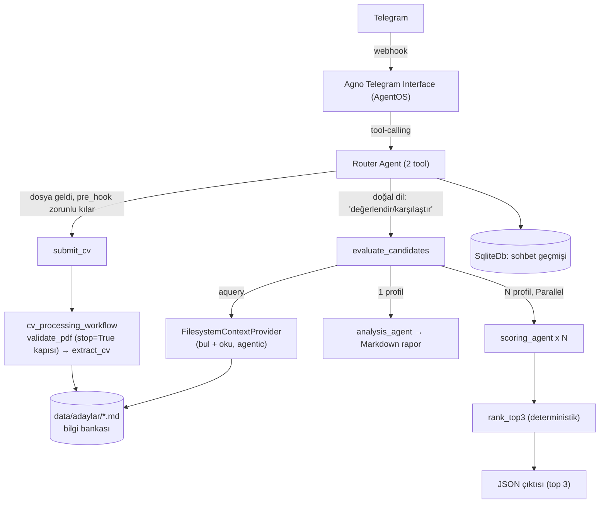
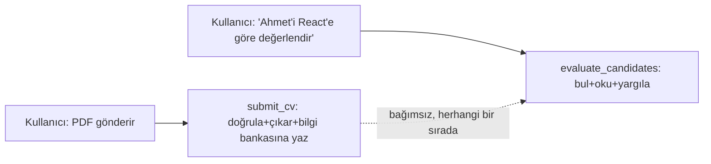
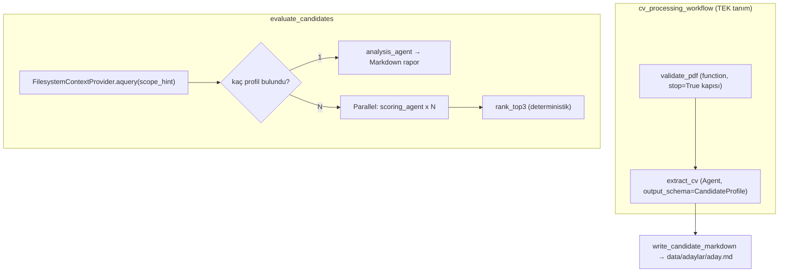

# Mimari Kararlar — telegram-ai-hr-bot

Bu doküman, "Yapay Zeka Destekli Dinamik Telegram İK ve Sohbet Botu" ödevi için alınan
mimari kararları ve gerekçelerini kayıt altına alır. Kod yazılmadan önce hazırlanmıştır;
amaç hem geliştirme sırasında referans olmak hem de mülakat savunmasında "neden böyle
tasarladın" sorularına net cevap verebilmektir.

> **Çalışma ilkeleri (KISS, aşamalı geliştirme, best-practice zorunluluğu) için
> `AGENTS.md` §0'a bakınız.** Bu ilkeler tüm projede geçerlidir, burada tekrar
> edilmez.

## 1. Genel Bakış

Bot iki modda çalışır:

1. **Genel sohbet** — bağlamı (chat history) koruyan serbest sohbet.
2. **İK modu** — kullanıcının serbest metinle tanımladığı dinamik kriterlere göre CV
   analizi: tekli CV için nitel rapor, çoklu CV (maks. 5) için karşılaştırmalı skorlama.

## 2. Teknoloji Seçimleri

| Katman | Seçim | Gerekçe |
|---|---|---|
| Dil | Python 3.11+ | Agno framework'ü Python-native; ödevin izin verdiği 3 dilden biri. |
| Agent framework | **Agno** | `output_schema` ile yapılandırılmış çıktı, model-sağlayıcı soyutlaması, hazır Telegram interface'i, native `Workflow` primitifi. |
| Telegram bağlantısı | **Agno `AgentOS` + `Telegram` interface** | Hazır webhook/session altyapısı. Dosya erişimi doğrulandı (bkz. §9.1). |
| CV işleme pipeline'ı | **Tek, paylaşılan Agno `Workflow`** (`cv_processing_workflow`) | Ardışık çok-adımlı ajan zincirleri için Agno'nun idiom'u. Hem tekli hem çoklu değerlendirme **aynı nesneyi** çağırır. |
| Aday deposu | **Dosya tabanlı bilgi bankası** (`data/adaylar/*.md`) + `FilesystemContextProvider` | Bkz. §6 — `session_state` üzerinde bir state machine kurmak yerine, kalıcı/sorgulanabilir tek gerçek kaynak dosya sisteminde tutuluyor. Adayı bulma işi Agno'nun hazır dosya-arama mekanizmasına bırakılıyor, elle isim eşleştirme kodu yazılmıyor. |
| LLM sağlayıcı | **OpenAI (başlangıç) → Ollama (sonra)** | `MODEL_PROVIDER` env değişkeniyle tek satır değişiklikle geçiş. |
| Veritabanı | **SQLite** (`agno.db.sqlite.SqliteDb`) | Sıfır altyapı; `AgentOS(db=...)` seviyesinde tanımlanır, tüm bileşenlere otomatik atanır. |
| PDF işleme | `pypdf` | Doğrulama + metin çıkarımı, framework'ten bağımsız. |
| Paralellik | **Agno `Parallel` step** (native, limitsiz) | Elle `asyncio.Semaphore` yazmak yerine framework'ün kendi mekanizması. |
| Konteynerleştirme | v1'de **yok** | Bkz. §11. |

## 3. Sistem Mimarisi



**Katman sorumlulukları:**

- **Telegram Interface (Agno)**: webhook, medya indirme, session eşleme. Hazır.
- **Router Agent**: iki tool — `submit_cv` (yazan) ve `evaluate_candidates` (okuyan).
  Kararlılık gereksinimini LLM'in tutarlılığına değil koda dayandırıyoruz.
- **`cv_processing_workflow`**: bir adayı doğrulama+çıkarmanın tek, paylaşılan tarifi.
- **Bilgi bankası** (`data/adaylar/*.md`): tek gerçek veri kaynağı, hem yazan hem
  okuyan taraf bunu kullanır.
- **`FilesystemContextProvider`**: bilgi bankasını bulan/okuyan hazır Agno mekanizması.
- **Servisler**: `PdfValidator` — LLM'siz, saf Python.

## 4. Konuşma Akışı

**`session_state` bu pipeline için kullanılmıyor** — bkz. `AGENTS.md` §0 madde 6.
Önceki bir tasarım turunda bir state machine (`mode`, `set_dynamic_criteria`,
`start_batch_session`, `finalize_batch`, `pending_profile`) denenmiş, kullanıcı
geri bildirimiyle bilinçli olarak terk edilmiştir: kriterler "hatırlanan" bir durum
değil, her değerlendirme isteğiyle birlikte taze gelen bir argüman; adaylar
session'a değil dosya sistemine yazılıyor.



**Tetikleyiciler:**
- PDF geldiğinde → `pre_hook` LLM'i `submit_cv`'ye zorlar (deterministik, kod garantili).
- Kullanıcı bir/birden fazla adayı kriterleriyle değerlendirmek istediğinde → LLM
  `evaluate_candidates`'ı çağırır, kriterleri ve (varsa) aday ipucunu o anki
  cümleden çıkarıp argüman olarak geçer.

Bu iki tetikleyici **birbirinden bağımsızdır** — hangi sırayla gelirse gelsin çalışır:
CV önce gelip sonra değerlendirme istenebilir, ya da zaten bilgi bankasındaki
adaylar için doğrudan değerlendirme istenebilir.

## 5. Tool Tasarım İlkesi: "LLM router, kod garantör"

- LLM'in sorumluluğu **sadece** hangi tool'un çağrılacağı ve hangi argümanlarla.
- `submit_cv`'nin dosya geldiğinde çağrılması `pre_hook` ile kod seviyesinde garanti
  edilir (bkz. §9.1) — LLM'in inisiyatifine bırakılmaz.
- `evaluate_candidates`'ın **içindeki** adayı bulma (agentic, `FilesystemContextProvider`)
  dışındaki her adım (kaç profil bulundu → tekli/çoklu dallanma, ortalama hesabı,
  sıralama) saf Python — LLM'e bırakılmaz.
- Her iki tool da `cv_processing_workflow`'u (doğrudan ya da dolaylı) kullanır — adım
  sırası kod tarafından sabit.

## 6. CV İşleme — Yazan / Okuyan Ayrımı

**Kilit karar:** Sistem iki bağımsız sorumluluğa ayrılıyor:

1. **Yazan taraf (`submit_cv` → `cv_processing_workflow`)** — bir CV geldiğinde,
   kriter olsun olmasın, **her zaman** çalışır: doğrular, çıkarır, bilgi bankasına
   (`data/adaylar/<slug>.md`) yazar.
2. **Okuyan taraf (`evaluate_candidates`)** — kullanıcı bir değerlendirme isteğinde
   bulunduğunda çalışır: bilgi bankasından ilgili aday(lar)ı **agentic olarak**
   bulur/okur, sayıya göre tekli ya da çoklu değerlendirmeye dallanır.



**Kritik tasarım kuralları:**

1. **Doğrulama kapısı:** `validate_pdf`, `PdfValidator`'ı (§8) çağıran bir
   function-executor. Geçersizse `StepOutput(content=hata_mesajı, stop=True)`
   döner. Bunu tespit etmenin **doğru** yolu — kurulu Agno paketinde elle
   doğrulandı — dönen `WorkflowRunOutput`'un `step_results[-1].stop` alanına
   bakmaktır (`isinstance(content, str)` gibi dolaylı bir tahmine **değil**; bkz.
   `AGENTS.md` §2).
2. **Structured output zincirleme:** `extract_cv`, `output_schema=CandidateProfile`
   ile çalışan bir Agent step; çıktısı tipli bir Pydantic nesnesi olarak döner.
3. **Bilgi bankası formatı:** her aday `data/adaylar/<slug>.md` — insan/LLM okunaklı
   Markdown (isim, beceriler, deneyim, diller, eğitim). JSON değil, çünkü okuyan
   taraf zaten bir LLM (`FilesystemContextProvider`'ın alt-ajanı ve
   `analysis_agent`/`scoring_agent`) — Markdown onlar için doğal girdi.
3. **Adayı bulma agentic, okuma deterministik:** `evaluate_candidates`,
   `FilesystemContextProvider.aquery(scope_hint)` çağırır (§9.2) — bu, isim
   eşleştirme/belirsizlik çözme işini bizim yerimize yapar. Bulunan dosyaların
   **tam içeriği** ise düz Python ile (`Path.read_text()`) okunur — kesilmiş bir
   `snippet`'e güvenilmez, yargılama tam metinle yapılır.
4. **Tekli/çoklu ayrımı artık bir mod değil, bir sayım:** bulunan profil sayısı 1
   ise nitel analiz, N ise paralel skorlama + sıralama. Ayrı komutlara
   (`/batch_analyze` vb.) gerek yok.
5. **`rank_top3`:** `Parallel` bloğunun tüm çıktıları toplanır, `averageScore`
   Python'da hesaplanır (LLM'e bırakılmaz), ilk 3 aday sıralanıp ödevin JSON
   şemasına dönüştürülür.

## 7. Veri Modelleri

**`PdfValidationResult`** (§8'deki 6 kontrolün tipli çıktısı — LLM'siz):
```
status: EMPTY_FILE | NOT_A_PDF | ENCRYPTED | CORRUPTED | EMPTY_PDF | NO_EXTRACTABLE_TEXT | VALID
extracted_text: str | None
user_message: str | None
```

**`CandidateProfile`** (LLM Extraction'ın ürettiği ortak şema):
```
full_name: str | None
skills: list[str]
work_experience: list[str]
languages: list[str]
education: list[str]
```

**`SingleAnalysisResult`**:
```
candidate_name: str
strengths: list[str]
weaknesses: list[str]
recommendations: list[str]
markdown_report: str
```

**`CandidateScore`** ve **`BatchAnalysisResult`** — ödev dokümanındaki JSON şemasıyla
birebir aynı alan adları (`status`, `processedCVCount`, `userDefinedCriteria`,
`topCandidates[].rank/candidateName/pdfFileName/dynamicScores/averageScore/hrEvaluation`).
`dynamicScores` değerleri `Field(ge=0, le=100)` ile kısıtlanır. `candidateName` boş
dönerse dosya adı fallback olarak kullanılır.

## 8. PDF Doğrulama

`cv_processing_workflow`'un **ilk adımı** olan `validate_pdf`, her türlü LLM
çağrısından **önce** çalışan, tamamen deterministik bir `PdfValidator` servisini
sarmalar:

| # | Kontrol | Nasıl | Durum kodu |
|---|---|---|---|
| 1 | Boş dosya | `len(content) == 0` | `EMPTY_FILE` |
| 2 | Gerçekten PDF mi | ilk 5 bayt `%PDF-` magic number (uzantıya güvenilmez) | `NOT_A_PDF` |
| 3 | Şifreli mi | `reader.is_encrypted`, boş parola denemesi | `ENCRYPTED` |
| 4 | Bozuk / açılamıyor | `PdfReadError`/`PdfStreamError` | `CORRUPTED` |
| 5 | Sayfasız | `len(reader.pages) == 0` | `EMPTY_PDF` |
| 6 | Metin çıkarılamıyor | birleşik metin < 50 karakter | `NO_EXTRACTABLE_TEXT` |

Sadece hepsi geçerse `extracted_text` doldurulur. `tests/test_pdf_validator.py`
gerçek, elle hazırlanmış örnek dosyalarla test eder — mock'a gerek yok.

## 9. Bilinen Riskler ve Doğrulanan Mekanizmalar

### 9.1 ÇÖZÜLDÜ — Dosya erişimi

Agno, `images`/`videos`/`audios`/`files` parametrelerini "tool built-in parameters"
olarak tanımlıyor, o turun ekli medyasını otomatik enjekte ediyor —
`submit_cv(run_context, files: Optional[Sequence[File]] = None)` yeterli. Router
Agent `send_media_to_model=False, store_media=True` ile yapılandırılır — PDF ham
baytları LLM'e gönderilmez, extraction tamamen `pypdf` + Extraction Agent
zincirimiz üzerinden yürür.

### 9.2 ÇÖZÜLDÜ — Workflow'un `stop=True` durumunu doğru tespit etme

Kurulu Agno paketinde (`agno==2.8.6`) izole, LLM'siz bir test workflow'uyla elle
doğrulandı: bir adım `StepOutput(stop=True)` döndürdüğünde, sonraki adımlar hiç
çalışmıyor ve `WorkflowRunOutput.step_results[-1].stop == True` oluyor —
`RunStatus` her iki durumda da `completed` kaldığı için ona bakılamaz,
`step_results[-1].stop` doğru ve tek güvenilir kontrol.

### 9.3 ÇÖZÜLDÜ — `FilesystemContextProvider` doğrudan çağrılabiliyor

Kurulu pakette `FilesystemContextProvider.query()`/`aquery(question: str) -> Answer`
metotları var (`Answer(results: list[Document], text: str | None)`,
`Document(id, name, uri, source, snippet)`) — bir Agent'a `tools=fs.get_tools()`
olarak bağlamaya **gerek olmadan**, `evaluate_candidates` tool'u içinden doğrudan
`await candidate_knowledge.aquery(...)` ile çağrılabiliyor. Bulunan dosyaların tam
içeriği `Document.uri`'den düz Python ile okunuyor (snippet'e güvenilmiyor).

### 9.4 Açık — Skorların kalibrasyonu

Çoklu değerlendirmede her aday, birbirinden habersiz, paralel bir `scoring_agent`
çağrısıyla puanlanıyor. Bir CV'ye verilen "85" puanı başka bir paralel çağrıdaki
"85" ile tam aynı ölçekte olmayabilir. v1'de kabul ediliyor çünkü alternatifi
(hepsini tek çağrıda birlikte skorlamak) paralelliği ortadan kaldırır ve ödevin
"paralel işleme" kriteriyle çelişir.

## 10. Değerlendirme Kriterleri Karşılama Tablosu

| Ödev gereksinimi | Karşılık |
|---|---|
| §3: "tüm puanlama, detaylı analiz ve filtreleme... ortak JSON yapısı üzerinden" | `cv_processing_workflow` tek, paylaşılan extraction — hem `analysis_agent` hem `scoring_agent` aynı `CandidateProfile`'ı (bilgi bankası üzerinden) kullanır. |
| §2: tekli CV → detaylı nitel rapor | `evaluate_candidates`, 1 profil bulununca `analysis_agent` → `SingleAnalysisResult.markdown_report`. |
| §4: çoklu CV (≤5) → paralel işleme + top-3 JSON | `evaluate_candidates`, N profil bulununca `Parallel(scoring_agent x N)` → `rank_top3` → ödev JSON şeması. |
| §4: "asenkron veya paralel thread'ler üzerinde hızlıca" | Agno native `Parallel`, elle `asyncio` yazılmadan. |
| Kriter #1: kararlılık | `pre_hook` + deterministik tool içi mantık — LLM sadece hangi tool'u çağıracağına karar verir. |

## 11. v1 Kapsamı

**Dahil:** Genel sohbet, dosya tabanlı aday bilgi bankası, tekli CV nitel analiz,
çoklu CV paralel skorlama + JSON çıktı, PDF validasyonu, OpenAI entegrasyonu, birim
testleri (PDF validator — LLM çağrıları mock'lanarak diğerleri).

**Dahil değil (sonraki iterasyon):** Docker/docker-compose, Ollama'ya geçiş, OCR
destekli taranmış PDF okuma, çoklu kullanıcı yük testleri, mesaj bazlı rate limiting.

## 12. Klasör Yapısı

```
telegram-ai-hr-bot/
├── ARCHITECTURE.md
├── AGENTS.md
├── README.md
├── .env.example
├── requirements.txt
├── src/
│   ├── main.py                        # AgentOS + Telegram + submit_cv/evaluate_candidates wiring
│   ├── config.py
│   ├── models/model_factory.py
│   ├── domain/                        # CandidateProfile, SingleAnalysisResult, CandidateScore,
│   │                                   # BatchAnalysisResult, PdfValidationResult
│   ├── services/
│   │   ├── pdf_validator.py           # LLM'siz, 6 kontrol
│   │   └── candidate_store.py         # write_candidate_markdown, slugify, dosya okuma yardımcıları
│   ├── agents/
│   │   ├── extraction_agent.py
│   │   ├── analysis_agent.py
│   │   └── scoring_agent.py
│   └── workflows/
│       ├── cv_processing_workflow.py  # TEK paylaşılan tarif (validate_pdf + extract_cv)
│       └── batch_scoring.py           # Parallel + rank_top3 yardımcıları
└── tests/
    └── test_pdf_validator.py
```

## 13. Aşamalı Uygulama Planı

| Aşama | Kapsam | Başarı Kriteri |
|---|---|---|
| **0 — Hello World** ✅ | Tool'suz Agent + Telegram interface. | `/start` → cevap. |
| **1 — Sohbet + Session** ✅ | `SqliteDb`, konuşma geçmişi. | Bota ismini söyle, sonra sorunca hatırlasın. |
| **2 — Bilgi bankası + Değerlendirme** | `PdfValidator`, `cv_processing_workflow`, `extraction_agent`, `analysis_agent`, `scoring_agent`, `submit_cv`, `evaluate_candidates`, `FilesystemContextProvider`. | Gerçek bir CV gönder → bilgi bankasına eklendiği bildirilsin. "Bu adayı X'e göre değerlendir" de → Markdown rapor gelsin. 2+ CV gönderip "karşılaştır" de → JSON top-3 gelsin. Bozuk/şifreli PDF'te net hata mesajı. |
| **3 (opsiyonel) — Ollama, Docker** | `MODEL_PROVIDER=ollama` ile canlı test, Dockerfile/docker-compose. | Aynı senaryolar yerel Ollama modeliyle çalışır. |
