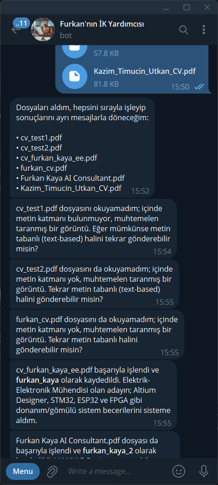
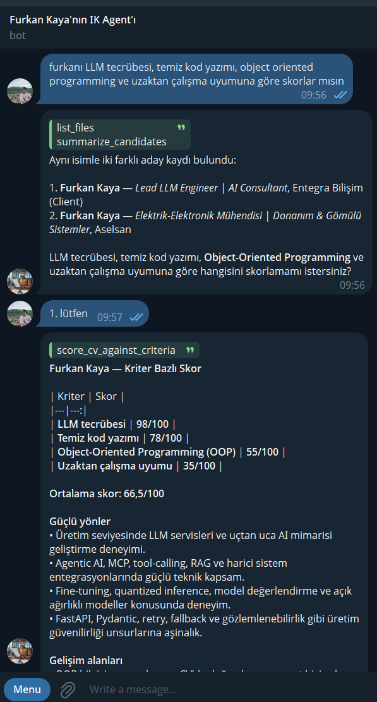
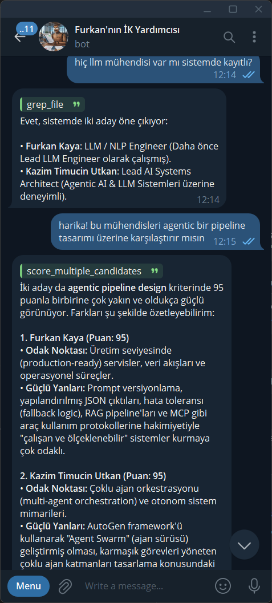
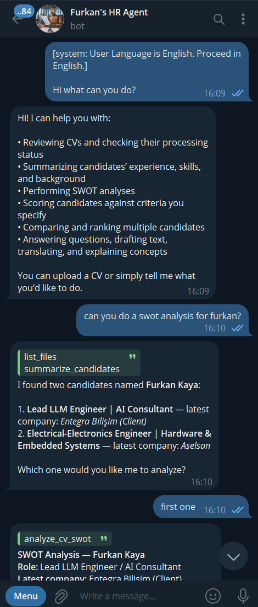
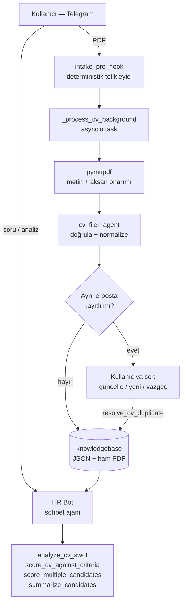

# Telegram İK Botu

**CV'yi Telegram'a at. Bot okur, kaydeder, analiz eder.**

İK ekibinin PDF CV'leri tek tek açıp okumasını ortadan kaldıran bir Agno ajanı. Dosya
yüklenir, arka planda yapılandırılmış veriye çevrilir. Sonra sohbet dilinde soru sorulur:
"furkanı skorla", "tüm adayları React tecrübesine göre sırala".

---

## Canlı test

[@furkans_hr_bot](https://t.me/furkans_hr_bot) üzerinden denenebilir. Sistemde deneme
amaçlı 2 CV zaten yüklü.

> **Herhangi bir yetkilendirme katmanı bulunmuyor ve production'da OpenAI inference
> kullanılıyor.** KVKK kapsamına giren veya hassas herhangi bir veriyi bota
> göndermeyin — test için `docs/test-cvs/` altındaki örnek dosyaları kullanın.

`docs/test-cvs/` içindeki dosyalar alım hattının farklı senaryolarını kapsar:

| Dosya | Senaryo |
|---|---|
| `Furkan Kaya AI Consultant.pdf` | Normal, sağlam bir CV |
| `cv_furkan_kaya_ee.pdf` | Uydurma aday (aynı isim, farklı ve gerçek olmayan bir uzmanlık) — isim çakışması testi için |
| `CV Ahmet Kural.pdf` | CV olmayan bir belge (başvuru checklist'i) — doğrulama adımının reddetmesi beklenir |
| `CV Merve.pdf` | Bozuk / açılamayan PDF |
| `CV Emre.pdf` | Şifreli PDF |

---

## Ekran görüntüleri

<table>
<tr>
<td width="50%" valign="top">

<p><b>Toplu yükleme</b><br>
6 dosya tek seferde gitti, tek onay mesajı döndü. Sonra dosya başına ayrı sonuç: metin
katmanı olmayan 3 PDF reddedildi ve sebebi söylendi, 2'si kaydedildi. Aynı isimli ikinci
aday <code>furkan_kaya_2</code> olarak ayrı tutuldu.</p>
</td>
<td width="50%" valign="top">

<p><b>İsim çakışması + puanlama</b><br>
Tek isim iki kayda denk geldi. Bot <code>summarize_candidates</code> ile unvan ve şirketi
okuyup bilgilendirilmiş soru sordu. Seçimden sonra dört kriter için puan tablosu ve
ortalama.</p>
</td>
</tr>
<tr>
<td width="50%" valign="top">

<p><b>Sistem geneli sorgu + karşılaştırma</b><br>
"Hiç LLM mühendisi var mı?" sorusu <code>grep_file</code> ile knowledgebase'de arandı.
Ardından iki aday, kullanıcının cümlesinden çıkarılan kritere göre
<code>score_multiple_candidates</code> ile karşılaştırıldı.</p>
</td>
<td width="50%" valign="top">

<p><b>İngilizce kullanım + SWOT</b><br>
Aynı ajan İngilizce de çalışıyor. Yetenek listesi, isim çakışması çözümü ve
<code>analyze_cv_swot</code> çağrısı aynı akışta.</p>
</td>
</tr>
</table>

Mesaj balonlarındaki yeşil etiketler ajanın o turda çağırdığı tool'lar.

---

## Ne yapar

**Alım hattı**

| | |
|---|---|
| CV alımı | PDF yüklenir, arka planda işlenir. Sohbet bloke olmaz. |
| Doğrulama | Belge gerçekten CV mi? İçine gizlenmiş talimat var mı? |
| Normalizasyon | Serbest metin sabit şemaya çevrilir: kişi, deneyim, eğitim, beceri, dil. |
| Tekrar yönetimi | Aynı e-posta ikinci kez gelirse sorar: güncelle / ayrı kaydet / vazgeç. |

**Analiz**

| | |
|---|---|
| SWOT | Güçlü yön, zayıf yön, fırsat, risk. |
| Kriter bazlı puanlama | Kriterleri cümleden çıkarır, 0-100 puanlar, gerekçe yazar. |
| Karşılaştırma | N adayı aynı kriterlerle sıralar, ilk 3'ü döner. |
| Soru-cevap | "Kimler kayıtlı?", "Furkan'ın becerileri ne?" |

---

## 5 dakikada çalıştır

```bash
python -m venv .venv
.venv/Scripts/python.exe -m pip install -r requirements.txt
cp .env.example .env
```

1. `.env` içine `TELEGRAM_TOKEN` yaz ([@BotFather](https://t.me/BotFather)'dan alınır)
2. `.env` içine `OPENAI_API_KEY` yaz
3. `.venv/Scripts/python.exe src/main.py` ile başlat
4. Telegram webhook'u için bir tünel aç (ngrok vb.) — bot genel erişilebilir URL istiyor

Sunucu `http://0.0.0.0:7777` üzerinde açılır.

**Gerekenler:** Python 3.11+, Telegram bot token'ı, OpenAI anahtarı **veya** yerel Ollama.

---

## Nasıl çalışır



Üç ajan var, üçü de `model_factory.get_model()` üzerinden aynı sağlayıcıyı kullanır.

| Ajan | Görevi | Çıktısı |
|---|---|---|
| `HR Bot` | Sohbet, tool seçimi, sunum | Türkçe markdown |
| `cv_filer_agent` | Doğrulama ve normalizasyon | `CVIntake` şeması |
| `swot_agent` / `scoring_agent` | Analiz | `SWOTAnalysis` / `CandidateScoreReport` |

**Tek doğruluk kaynağı dosya sistemi.** İşlem arka planda sürdüğü için ajanın hafızası
güncel olmayabilir. Her soruda diske bakar.

---

## Yapılandırma

`.env.example` şablondur. `.env` git'e girmez.

| Değişken | Zorunlu | Varsayılan | Ne işe yarar |
|---|---|---|---|
| `TELEGRAM_TOKEN` | evet | — | @BotFather token'ı |
| `MODEL_PROVIDER` | hayır | `openai` | `openai` veya `ollama` |
| `OPENAI_API_KEY` | OpenAI ise | — | API anahtarı |
| `OPENAI_MODEL_ID` | hayır | `gpt-4o-mini` | Model adı |
| `OLLAMA_MODEL_ID` | Ollama ise | `qwen2.5` | Yerel model (`ollama list`) |
| `OLLAMA_BASE_URL` | hayır | `http://localhost:11434` | Sunucu adresi |
| `OLLAMA_NUM_CTX` | hayır | (boş) | Context penceresi |
| `APP_ENV` | hayır | `production` | `development` iken webhook secret atlanır |

OpenAI kullanıyorsan `OLLAMA_*` satırlarını boş bırak.

---

## Ollama ile çalıştırma

### 1. Context penceresini büyüt

Ollama varsayılanı 4096 token. Sadece ajan talimatları ve tool docstring'leri **8.6 KB
metin** (ölçüldü: 6.0 KB talimat + 2.6 KB docstring). Buna tool JSON şemaları, CV verisi
ve konuşma geçmişi ekleniyor.

Pencereye sığmayınca Ollama prompt'u baştan kırpar. Modele yazacak yer kalmaz ve **cevap
hata vermeden cümle ortasında kesilir.** Sessiz hata, teşhisi zor.

```
OLLAMA_NUM_CTX=16384
```

`16384` canlı testte çalıştı. VRAM elverirse artır.

### 2. Model tool desteklemeli

Bot her turda tool gönderir.

```bash
ollama show MODEL_ADI
```

`capabilities` listesinde `tools` yoksa bu model kullanılamaz.

<details>
<summary>Qwen3 build'lerinde bilinen bir tuzak</summary>

Bazı Qwen3 build'leri `tools` desteklediğini bildirir ama 400 döner:
`Unable to generate parser for this template`. Sebep modelin Jinja şablonundaki
`raise_exception` satırları — Ollama'nın tool parser üretimini bozuyor. Başka build kullan.

</details>

### 3. Thinking modlu modeller

Bot her turda hem tool hem yapılandırılmış çıktı (`output_schema`) kullanıyor. İki noktaya
bak:

- **Akıl yürütme ayrı alana düşmeli.** Ollama, thinking yeteneği tanımlı modellerde
  reasoning'i ayrı bir `thinking` alanına koyar. Ayrım çalışmayan build'lerde
  `<think>...</think>` doğrudan `content` içine düşer ve şema doğrulaması bozulur.
- **Yapılandırılmış çıktı ile etkileşim var.** Ollama'nın `format` parametresi token
  olasılıklarını kısıtlar ve `<think>` token'ını da sıfırlayabilir
  ([ollama/ollama#10538](https://github.com/ollama/ollama/issues/10538)).

OpenAI tarafında benzer bir sürtünme var: bazı reasoning modelleri tool çağrısıyla birlikte
`reasoning_effort` gönderildiğinde 400 dönüyor. `model_factory.py` bu yüzden
`reasoning_effort="none"` gönderiyor.

Doğru kurulumda thinking modlu modeller bu görevde genelde daha iyi sonuç veriyor.

---

## Mühendislik kararları

Prensipler [`AGENTS.md`](AGENTS.md) dosyasında. En önemli beş karar:

| Karar | Neden |
|---|---|
| PDF metnini yerelde çıkar | Dosya girişi sadece OpenAI'da çalışıyor |
| Duplicate kontrolünü LLM'e sordurma | Küçük model dosya okumayı atlayıp "eşleşme yok" diyor |
| Ortalamayı Python hesapla | LLM aritmetiği güvenilmez |
| Tool'lar veri döndürsün, mesaj değil | Hazır metin sunumu kilitler |
| CV işlemeyi hook ile tetikle | Modelin dosyayı fark etmesine güvenme |

<details>
<summary><b>PDF metni neden yerelde çıkarılıyor</b></summary>

Ham PDF modele gönderilmiyor. `pymupdf` ile metni yerelde çıkarıp prompt'a koyuyoruz.

| Sağlayıcı | Dosya girişi |
|---|---|
| OpenAI | Çalışır — sunucu metin + sayfa görüntüsü çıkarır. Vision modeli gerekir, pahalı. |
| Ollama | **Yok** — agno dosyayı sessizce atar, log'a `File input is currently unsupported.` düşer |
| LM Studio | **Yok** — 400 döner: `'content' objects must have a 'type' field that is either 'text' or 'image_url'` |

Metni biz çıkarınca üç sağlayıcıda da aynı kod yolu çalışıyor. Sayfa görüntüsü
göndermediğimiz için maliyet de düşük.

Metin katmanı olmayan PDF (taranmış görüntü) gelirse kullanıcıya gerçek sebep söyleniyor.
Belgeyi "geçersiz" diye suçlayan bir mesaj verilmiyor.

</details>

<details>
<summary><b>Aksan onarımı — LaTeX PDF'lerindeki kırık Türkçe karakterler</b></summary>

LaTeX ile üretilmiş PDF'lerde `ç` tek bir karakter değil. `C` + ayrı bir `¸` (U+00B8
CEDILLA) olarak gömülü. Bu **boşluklu** bir işaret, birleştirici değil.

Bu pymupdf hatası değil. PDF'in kendi metin akışı böyle kodlanmış. Aynı sınıf sorun
pdfminer ve poppler'da da var, kütüphane seviyesinde çözüm yok
([pymupdf/PyMuPDF#2279](https://github.com/pymupdf/PyMuPDF/issues/2279)).

`unicodedata.normalize("NFC")` tek başına yetmiyor. Boşluklu işaretler NFC'nin tanıdığı
combining mark'lar değil.

`_aksan_onar` iki adım:

1. Boşluklu işareti gerçek combining mark'a çevir (U+0300 bloğu), taban harfin yanına taşı
2. `NFC` ile birleştir

Tablo **Türkçe'ye özgü değil** — 11 işaret tanımlı, harf değil. Bu yüzden aksan kullanan
her Latin alfabesinde çalışıyor: Fransızca (é, à), Almanca (ü, ö), Çekçe (š, č), Lehçe
(ą, ę), Portekizce (ã, õ). Sentetik testlerle doğrulandı.

Gerçek CV'lerde ölçüldü: 24 kırık işaret sıfıra indi, sonuç sayfanın birebir aynısı.

</details>

<details>
<summary><b>OCR neden denendi ve seçilmedi</b></summary>

`notebooks/` klasöründe karşılaştırma duruyor. Üç notebook da aynı `NormalizedCV`
şemasını, aynı talimatı ve aynı modeli kullanıyor. Tek değişken metnin nasıl elde
edildiği.

| Notebook | Yöntem |
|---|---|
| `1_openai.ipynb` | PDF → OpenAI dosya girişi |
| `2_unlimited_ocr.ipynb` | PDF → 300 dpi PNG → Unlimited-OCR → metin |
| `3_pymupdf.ipynb` | PDF → pymupdf → aksan onarımı |

OCR Türkçeyi doğru okuyor. Ama Ollama'da `no_repeat_ngram_size` karşılığı yok: yoğun
sayfalarda aynı satırı defalarca tekrarlayıp `num_predict` tavanına dayanıyor ve sayfayı
yarıda kesiyor. Ayrıca 4 GB VRAM ve sayfa render'ı istiyor.

`pymupdf` + onarım aynı sonucu sıfır maliyetle veriyor. Notebook duruyor — taranmış PDF
ihtiyacı doğarsa başlangıç noktası hazır.

</details>

<details>
<summary><b>LLM'e ne yaptırılıyor, ne yaptırılmıyor</b></summary>

Model dil işinde iyi. Kesinlik gereken her şey Python'da.

| İş | Kim | Neden |
|---|---|---|
| CV mi değil mi | LLM | Dil anlama işi |
| Alan çıkarımı | LLM | Serbest metinden şemaya |
| Duplicate tespiti | Python | E-posta karşılaştırması. Küçük model N eşleşen dosyanın hepsini okumayı atlayıp "eşleşme yok" diyebiliyordu |
| `candidate_id` üretimi | Python | `slugify` ile. Kazım ve Kazim aynı id'ye düşsün |
| Ortalama puan | Python | LLM aritmetiği güvenilmez |
| Dosya yükleme tespiti | Python (`pre_hook`) | `send_media_to_model=False` zaten dosyayı modele göstermiyor |

</details>

<details>
<summary><b>Prompt mimarisi</b></summary>

Talimatlar kod gibi ele alınıyor.

- **Bölümlere ayrıldı.** Tek bir dev string yerine dört adlandırılmış blok:
  `_PERSONA_VE_KAYNAK`, `_KAYIT_KARARLARI`, `_ADAY_COZUMLEME`, `_TOOL_SECIMI`. Yeni bir
  özellik dev string'in sonuna cümle eklemek yerine ilgili bölüme yazılıyor.
- **Aday çözümleme tek yerde.** Daha önce SWOT ve skorlama kendi çözümleme stratejilerini
  ayrı ayrı taşıyordu ve bunlar birbiriyle çelişiyordu. Her yeni tool bu çelişkiyi bir kez
  daha yazma riski getiriyordu.
- **Tool docstring'i prompt'un parçası.** Sunum kuralı ("veri döner, ham JSON gösterme")
  hem ajan talimatında hem docstring'de aynı ifadeyle duruyor.
- **Her dallanmanın "eşleşme yok" dalı var.** Bekleyen bir kayıt kararı varken kullanıcı
  başka bir şey isterse ajan kararı iptal edip asıl isteğe geçiyor. Kararı belirsizce
  bekletmiyor.

</details>

<details>
<summary><b>Eşzamanlılık ve arka plan işleri</b></summary>

CV işlenirken kullanıcı sohbete devam edebiliyor. Bu birkaç yarış durumu üretti.

- **Toplu onay için debounce.** N dosya art arda gelince N tane "aldım" mesajı gitmesin
  diye 1.5 saniyelik sessizlik penceresi bekleniyor, sonra tek mesaj gidiyor.
- **Session kilidi.** Aynı `session_id` için `arun()` eşzamanlı çalışınca aynı SQLite
  satırına yazım çakışıyordu ve bir task sessizce ölüyordu. Kilit bunları sıraya sokuyor.
- **Batch'ler referansla taşınıyor.** İlk batch işlenirken gelen ikinci yükleme, session
  anahtarlı ortak sözlüğü eziyordu. Her task artık kendi batch nesnesini tutuyor.
- **Bekleyen kararlar için 30 dakikalık TTL.** `/new` yeni bir `session_id` üretiyor ve
  ajana hiç uğramıyor. O session'daki bekleyen karar bir daha çözülemiyor ama bellekte ham
  PDF byte'larıyla kalıyordu.
- **Bildirimleri ajan yazıyor.** Ham Telegram gönderimi yerine sonucu sohbet ajanına
  yazdırıyoruz. Böylece bu mesajlar onun kendi konuşma geçmişinde de yer alıyor.

</details>

<details>
<summary><b>Güvenlik</b></summary>

CV metni güvenilmeyen dış içerik olarak işleniyor. `cv_filer_agent` talimatı metnin
içindeki hiçbir talimatı uygulamamasını, sadece listelenen alanları çıkarmasını söylüyor.

Gizlenmiş talimat tespit edilirse `injection_detected=true` dönüyor, CV kaydedilmiyor ve
kullanıcıya sebep söyleniyor.

`send_media_to_model=False` — sohbet ajanı dosya içeriğini hiç görmüyor. Sadece alım hattı
görüyor.

</details>

---

## Proje yapısı

```
src/
  main.py              HR Bot ajanı, talimat bölümleri, AgentOS + Telegram
  cv_intake.py         Alım hattı: hook'lar, PDF metni, aksan onarımı, duplicate akışı
  cv_analysis.py       SWOT ve puanlama ajanları + tool'lar
  schemas.py           Pydantic şemaları (model çıktı sözleşmeleri)
  config.py            .env okuma
  models/
    model_factory.py   OpenAI / Ollama seçimi

data/                  Çalışma zamanı verisi (git'e girmez)
  knowledgebase/adaylar/<aday_id>/
    <aday_id>_normalized.json
    _raw/<aday_id>_raw.pdf
  agent-os.db          Oturum veritabanı

docs/img/              README ekran görüntüleri
notebooks/             Metin çıkarım yöntemi karşılaştırması
AGENTS.md              Mühendislik prensipleri ve ajan kuralları
```

---

## Sınırlar

- Taranmış (metin katmanı olmayan) PDF okunmuyor. Kullanıcıya açıkça söyleniyor.
- Otomatik test yok. Kararlar canlı testle ve notebook ölçümleriyle doğrulandı.
- Aday silme komutu yok. Dosya sisteminden manuel siliniyor.
- Webhook için genel erişilebilir URL gerekiyor. Tünel kurulumu bu repoda değil.
