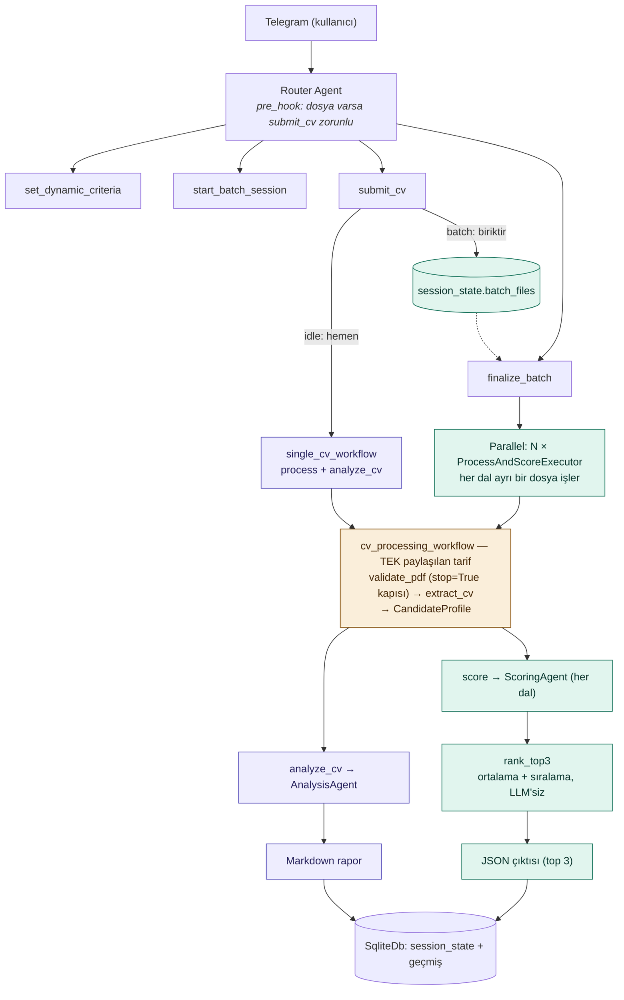

# telegram-ai-hr-bot

Bu proje bir Telegram botudur. Bot yapay zeka kullanır. Kullanıcı bota serbest
metinle kriterler verir. Bot bu kriterlere göre CV'leri değerlendirir. Bot ayrıca
genel sohbet de yapar.

> Bu proje aktif geliştirme aşamasındadır. Mimari kararlar ve gerekçeleri için
> [ARCHITECTURE.md](./ARCHITECTURE.md)'ye bak. Ajan tasarımı için
> [AGENTS.md](./AGENTS.md)'ye bak. Çalışma ilkeleri (KISS, aşamalı geliştirme)
> `AGENTS.md` §0'dadır.

## Mimari

Tekli ve toplu CV işleme aynı pipeline'ı kullanır: `cv_processing_workflow`. Tekli
mod bu pipeline'ı bir kez çalıştırır. Toplu mod aynı pipeline'ı N aday için paralel
çalıştırır. Ayrıntılı gerekçe `ARCHITECTURE.md` §6'dadır. Ödevin bu tasarımı nasıl
gerektirdiğini `ARCHITECTURE.md` §3 ve §4 açıklar.

## Durum

- [x] Proje deposu oluşturuldu
- [x] Mimari kararlar dokümante edildi (`ARCHITECTURE.md`, `AGENTS.md`)
- [x] **Aşama 0** — Hello World (Telegram bağlantısı, araçsız sohbet)
- [ ] **Aşama 1** — Sohbet + session (konuşma geçmişi)
- [ ] **Aşama 2** — Dinamik kriter + tekli CV analizi (`cv_processing_workflow`, PDF doğrulaması, extraction, analiz)
- [ ] **Aşama 3** — Toplu CV + paralel skorlama (JSON çıktı)
- [ ] *(opsiyonel)* Aşama 4 — Aday bilgi bankası
- [ ] *(opsiyonel)* Aşama 5 — Ollama, Docker

Aşamaların ayrıntısı ve başarı kriterleri `ARCHITECTURE.md` §13'tedir.
