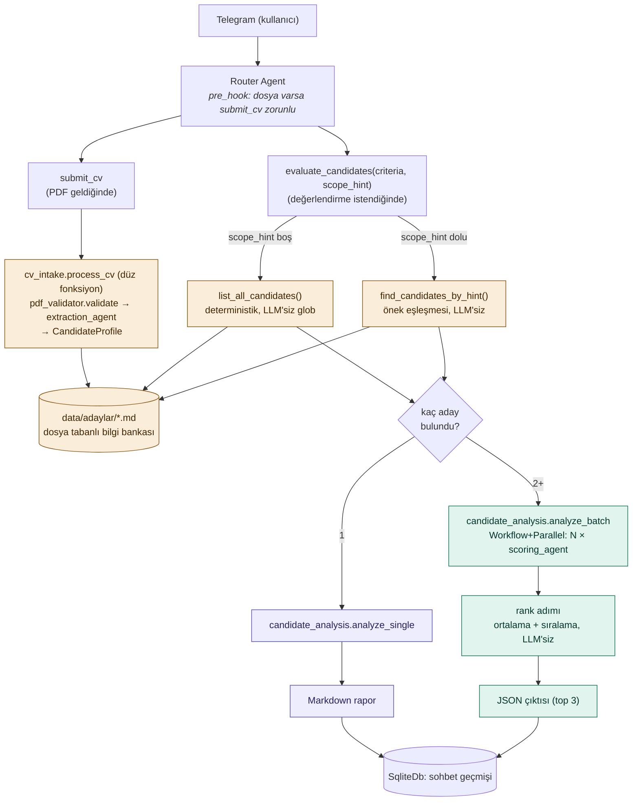

# telegram-ai-hr-bot

Yapay zeka destekli, dinamik kriterlere dayalı Telegram İK ve sohbet botu.

> Bu proje aktif geliştirme aşamasındadır. Mimari kararlar ve gerekçeleri için
> [ARCHITECTURE.md](./ARCHITECTURE.md) ve ajan tasarımı için [AGENTS.md](./AGENTS.md)
> dosyalarına bakınız. Çalışma ilkeleri (KISS, aşamalı geliştirme) `AGENTS.md` §0'da.
>
> **Yeni bir oturumdan devam ediyorsanız önce [TODO.md](./TODO.md)'yi okuyun** —
> güncel durum, operasyonel altyapı bilgisi ve somut sıradaki adımlar orada.

## Mimari

Yazan/okuyan ayrımına dayanır: CV'ler geldiğinde **otomatik** işlenip dosya
tabanlı bir bilgi bankasına (`data/adaylar/*.md`) yazılır; değerlendirme ise
**tamamen kullanıcı talebiyle**, o anki cümleden çıkarılan kriterlerle
tetiklenir — tekli/toplu ayrı tool'lar değil, bulunan aday sayısına göre kod
içinde dallanan tek bir akış. Detaylı gerekçe için `ARCHITECTURE.md` §6,
ödevin bunu nasıl gerektirdiği için §3/§4.

## Durum

- [x] Proje deposu oluşturuldu
- [x] Mimari kararlar dokümante edildi (`ARCHITECTURE.md`, `AGENTS.md`)
- [x] **Aşama 0** — Hello World (Telegram bağlantısı, tool'suz sohbet)
- [x] **Aşama 1** — Sohbet + session (konuşma geçmişi, `SqliteDb`)
- [x] **Aşama 2** — Bilgi bankası + değerlendirme (`submit_cv`/`evaluate_candidates`,
      PDF validasyonu, extraction, tekli+toplu analiz) — kod tamam, canlı test bekliyor
- [ ] *(opsiyonel)* Aşama 3 — Ollama, Docker

Aşamaların detayı ve başarı kriterleri için `ARCHITECTURE.md` §13, güncel
durum ve canlı test adımları için [TODO.md](./TODO.md).
