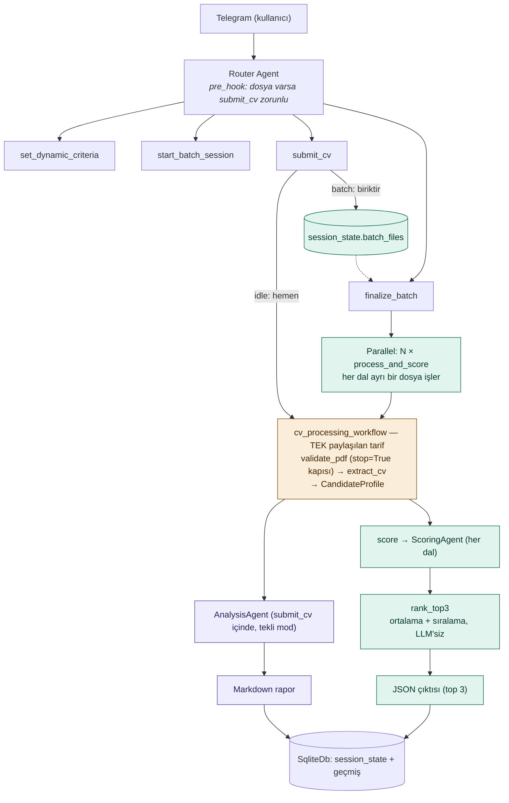

# telegram-ai-hr-bot

Yapay zeka destekli, dinamik kriterlere dayalı Telegram İK ve sohbet botu.

> Bu proje aktif geliştirme aşamasındadır. Mimari kararlar ve gerekçeleri için
> [ARCHITECTURE.md](./ARCHITECTURE.md) ve ajan tasarımı için [AGENTS.md](./AGENTS.md)
> dosyalarına bakınız. Çalışma ilkeleri (KISS, aşamalı geliştirme) `AGENTS.md` §0'da.
>
> **Yeni bir oturumdan devam ediyorsanız önce [TODO.md](./TODO.md)'yi okuyun** —
> güncel durum, operasyonel altyapı bilgisi ve somut sıradaki adımlar orada.

## Mimari

Tekli ve toplu CV işleme, **tek bir paylaşılan pipeline'ı** (`cv_processing_workflow`)
kullanır — biri bir kez, öbürü N aday için paralel çalıştırır. Detaylı gerekçe için
`ARCHITECTURE.md` §6, ödevin bunu nasıl gerektirdiği için §3/§4.

## Durum

- [x] Proje deposu oluşturuldu
- [x] Mimari kararlar dokümante edildi (`ARCHITECTURE.md`, `AGENTS.md`)
- [x] **Aşama 0** — Hello World (Telegram bağlantısı, tool'suz sohbet)
- [ ] **Aşama 1** — Sohbet + session (konuşma geçmişi)
- [ ] **Aşama 2** — Dinamik kriter + tekli CV analizi (`cv_processing_workflow`, PDF validasyonu, extraction, analiz)
- [ ] **Aşama 3** — Toplu CV + paralel skorlama (JSON çıktı)
- [ ] *(opsiyonel)* Aşama 4 — Aday bilgi bankası
- [ ] *(opsiyonel)* Aşama 5 — Ollama, Docker

Aşamaların detayı ve başarı kriterleri için `ARCHITECTURE.md` §13.
